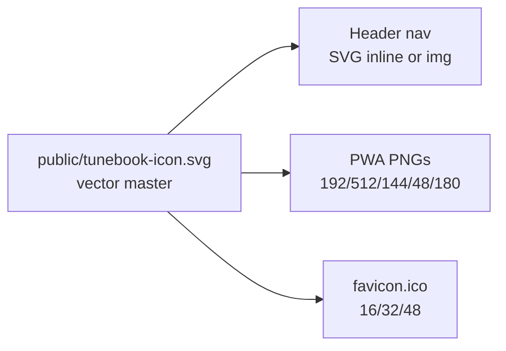

# Tune Book Icon Refresh

## Problem

The nav “back to list” button in [`src/components/Header.js`](src/components/Header.js) renders a 48×48 `favicon.png` at 40×40 — upscaling a low-res 8-bit PNG causes the graininess:

```192:192:src/components/Header.js

```

Icon assets are inconsistent across the app:

| File | Current state | Used by |
|------|---------------|---------|
| `favicon.png` (48×48) | Teal note on black, grainy | Header nav, apple-touch-icon |
| `favicon.ico` | Same art, 48×48 | Browser tab |
| `home-small.png` (48×48) | Same teal note | PWA manifest |
| `home-appicon.png` (144×144) | White folder+arrow+staff, grainy | PWA install icon |
| `logo192.png` / `logo512.png` | **Default React logos** (wrong app) | `public/manifest.json`, service worker cache |

Production manifest ([`manifest.template.json`](manifest.template.json)) only lists 48 and 144 px icons; modern install prompts expect 192 and 512.

## Recommended icon

**Remix Icon `book-music-line`** — same family already used in [`src/Icons.js`](src/Icons.js) (Remix Icon, Apache 2.0). A book with a music note clearly reads as “Tune Book” and stays legible at small sizes.

Two visual variants from one SVG source:



- **Nav/UI**: transparent background, **black** glyph (matches `color: 'black'` on the info button)
- **PWA / favicon / apple-touch**: **white** glyph on brand background `#2e00ff` (matches [`.App-header`](src/App.css) `background-color: #2e00ff`; also align `manifest.template.json` `theme_color` / `background_color` from `#3367D6` to `#2e00ff` for consistency)

## Implementation steps

### 1. Add master SVG to `public/`

Create [`public/tunebook-icon.svg`](public/tunebook-icon.svg) — clean Remix `book-music-line` path, 24×24 viewBox scaled to 512 canvas, no embedded raster.

Also add [`public/tunebook-icon-maskable.svg`](public/tunebook-icon-maskable.svg) (optional) with safe-zone padding for Android maskable icons if we add `"purpose": "maskable"` entries.

### 2. Generate raster exports

Use ImageMagick or Inkscape CLI (whichever is available on the dev machine) to export from the SVG:

| Output | Size | Style |
|--------|------|-------|
| `favicon.png` | 48×48 | white on `#2e00ff` |
| `apple-touch-icon.png` | 180×180 | white on `#2e00ff` |
| `home-small.png` | 48×48 | same as favicon |
| `home-appicon.png` | 144×144 | white on `#2e00ff` |
| `logo192.png` | 192×192 | white on `#2e00ff` |
| `logo512.png` | 512×512 | white on `#2e00ff` |
| `favicon.ico` | 16, 32, 48 | multi-size ICO |

Place all files in [`public/`](public/) (CRA copies `public/` → `build/` → repo root on `npm run build`).

Add a small script [`scripts/generate-icons.sh`](scripts/generate-icons.sh) (or document the commands in a comment at top of the SVG) so icons can be regenerated from the master without manual editing.

### 3. Update Header to use SVG (fixes graininess)

In [`src/components/Header.js`](src/components/Header.js), replace the `` with either:

- `` — simplest, scales crisply; or
- a tiny shared component `TuneBookIcon` that inlines the SVG with `currentColor` fill so it inherits button text color.

Prefer the SVG `` approach (minimal diff, no new component unless needed).

### 4. Unify PWA manifest

Update [`manifest.template.json`](manifest.template.json):

```json
"icons": [
  { "src": "/home-small.png", "sizes": "48x48", "type": "image/png" },
  { "src": "/home-appicon.png", "sizes": "144x144", "type": "image/png", "purpose": "any" },
  { "src": "/logo192.png", "sizes": "192x192", "type": "image/png", "purpose": "any" },
  { "src": "/logo512.png", "sizes": "512x512", "type": "image/png", "purpose": "any" }
],
"theme_color": "#2e00ff",
"background_color": "#2e00ff"
```

Sync [`public/manifest.json`](public/manifest.json) to match (dev server uses this until build overwrites root `manifest.json`).

### 5. Update HTML meta tags

In [`public/index.html`](public/index.html):

- `theme-color` → `#2e00ff`
- `apple-touch-icon` → `/apple-touch-icon.png` (180×180, not the 48px favicon)

### 6. Service worker cache

[`hackSw.js`](hackSw.js) already lists `favicon.ico`, `favicon.png`, `home-appicon.png`, `home-small.png`, `logo192.png`, `logo512.png`. Add `apple-touch-icon.png` and `tunebook-icon.svg` to `mainFiles`.

Run `npm run build` (or `node hackSw.js` after placing files) to regenerate [`sw.js`](sw.js).

### 7. Other sensible uses

No other UI currently references the old favicon. Optional low-cost additions:

- Add `tunebook-icon.svg` to the empty-state area on [`src/pages/BooksPage.js`](src/pages/BooksPage.js) when no books are loaded (small branding touch) — **only if you want it; skip if keeping scope minimal**.

Do **not** change the inline `'music'` Remix SVG in [`src/Icons.js`](src/Icons.js) — that icon means “has notation / cheat sheet” in tune rows and menus, not app branding.

## Files touched (summary)

| File | Change |
|------|--------|
| `public/tunebook-icon.svg` | **New** master icon |
| `public/favicon.png`, `favicon.ico`, `home-*.png`, `logo*.png`, `apple-touch-icon.png` | **Replace** with exports |
| `scripts/generate-icons.sh` | **New** regen script |
| `src/components/Header.js` | Use SVG icon |
| `manifest.template.json`, `public/manifest.json` | Full icon set + theme colors |
| `public/index.html` | theme-color + apple-touch-icon |
| `hackSw.js` | Cache new assets |

## Verification

1. `npm start` — nav button icon sharp at 40px on purple header
2. Browser tab favicon crisp
3. Chrome DevTools → Application → Manifest — all four PNG sizes present, no React logo
4. “Install app” / Add to Home Screen — new book+music icon on splash/install sheet
5. `npm run build` — icons copied to repo root, `sw.js` includes new paths
