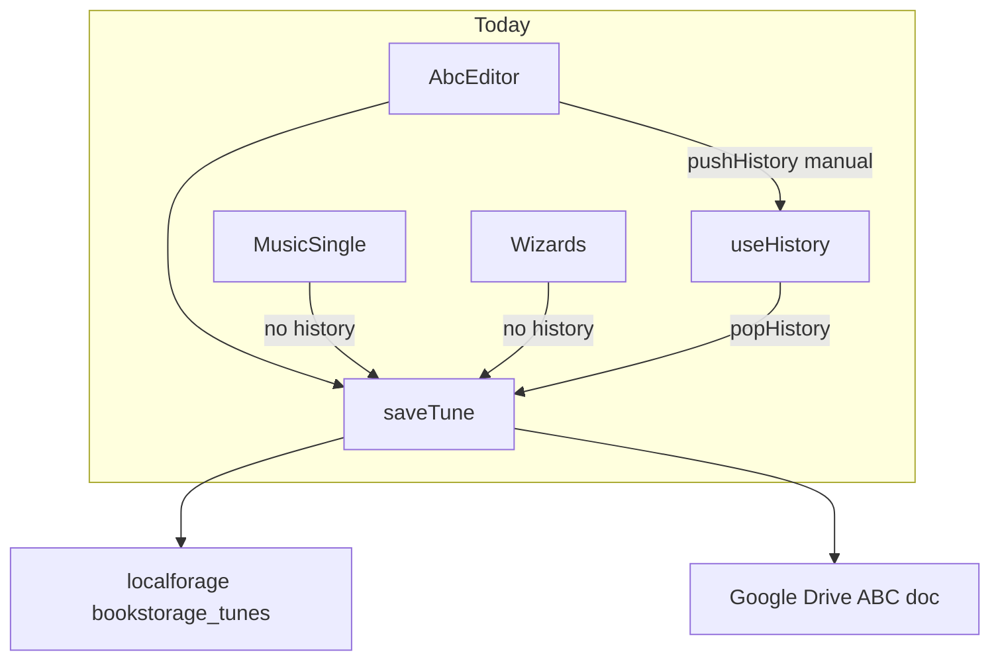
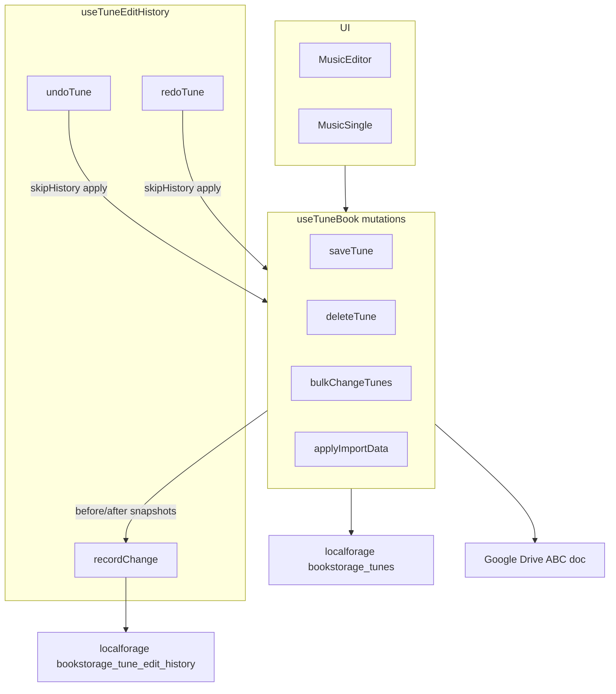

# Per-tune undo/redo for tune records

## Current state

- [`src/useHistory.js`](src/useHistory.js) keeps a session-only global stack with no redo; it is only wired into [`MusicEditor`](src/components/MusicEditor.js) / [`AbcEditor`](src/components/AbcEditor.js) via manual `pushHistory` calls.
- Most mutations bypass history entirely: [`MusicSingle`](src/components/MusicSingle.js) (lyrics modal, tags, links, wizards), [`TitleAndLyricsEditorModal`](src/components/TitleAndLyricsEditorModal.js), [`ChordsWizard`](src/components/ChordsWizard.js), [`MediaImportWizard`](src/components/MediaImportWizard.js), [`bulkChangeTunes`](src/useTuneBook.js), [`deleteTune(s)`](src/useTuneBook.js), [`applyImportData`](src/useTuneBook.js).
- All tune writes funnel through [`useTuneBook.saveTune`](src/useTuneBook.js) (line 240), but batch/import/delete paths mutate `tunes` directly.



## Target architecture

Centralize history at the **mutation layer** in `useTuneBook`, with **per-tune stacks** (your preference). History lives in a separate localforage key and is never serialized into the ABC document.



### History entry model (per tune)

```js
// bookstorage_tune_edit_history
{
  version: 1,
  stacks: {
    [tuneId]: {
      entries: [
        { id, ts, label, before: Tune|null, after: Tune|null, tombstoneBefore: Tombstone|null }
      ],
      index: 2   // highest applied entry; -1 = no history applied
    }
  }
}
```

- **Update**: `before` = deep clone before mutation, `after` = deep clone after.
- **Create**: `before = null`, `after = new tune`.
- **Delete**: `before = tune`, `after = null`; capture whether a tombstone existed in `tombstoneBefore` so undo can restore the tune and tombstone state correctly via existing [`clearTombstonesForTunes`](src/useTuneBook.js) / [`recordTombstone`](src/useTuneBook.js).
- **Batch ops** (`bulkChangeTunes`, `deleteTunes`, import): one entry per affected tune (each tune's stack gets its own snapshot). Undo on tune A only reverts A — consistent with per-tune scope.

### Coalescing rapid edits

`AbcEditor` calls `saveTune` on every keystroke in the note editor (no debounce). To avoid hundreds of entries per typing burst:

- Debounce **800ms per tuneId** when recording: first change captures `before`; subsequent changes within the window only update `after`.
- **Immediate** recording (no debounce) for discrete actions: wizard Save, media import finish, lyrics search apply, delete, import confirm, modal field commits. Pass `historyLabel` + `immediate: true` from call sites that need it, or auto-detect when `before`/`after` differ only after a wizard boundary.

Skip recording when `before` and `after` are structurally equal (JSON compare).

### Applying undo/redo

New internal helper `applyTuneSnapshot(tuneId, snapshot, { skipHistory: true })`:

| snapshot | action |
|---|---|
| `Tune` object | restore into `tunes`, re-index, `setTunes`, sync |
| `null` | remove from `tunes`, handle tombstone per entry metadata |

All apply paths use `skipHistory: true` to prevent feedback loops. Restore the full snapshot including `lastUpdated` so remote sync reflects the reverted state.

**Exclude** from history: remote merge/poll paths ([`applyMergeData`](src/useTuneBook.js), [`App.applyMergeChanges`](src/App.js)) — these are not user-initiated local edits.

## Files to add

| File | Purpose |
|---|---|
| [`src/tuneEditHistory.js`](src/tuneEditHistory.js) | Pure functions: clone, equal, push entry (with debounce state machine), undo/redo pointer math, prune |
| [`src/tuneEditHistory.test.js`](src/tuneEditHistory.test.js) | Unit tests for stack ops, coalescing, delete/create, truncation after undo |
| [`src/useTuneEditHistory.js`](src/useTuneEditHistory.js) | React hook: load/save localforage, expose `recordChange`, `undoTune`, `redoTune`, `canUndo`, `canRedo`, `undoLabel` |

Storage key: **`bookstorage_tune_edit_history`** (separate from `bookstorage_tunes` / `bookstorage_deleted_tunes`).

Limits: **50 entries per tune**, prune oldest; drop stacks for tune IDs no longer in the book after prune pass on load.

## Files to modify

### [`src/useTuneBook.js`](src/useTuneBook.js)

- Accept `editHistory` from App.
- Add `skipHistory` option to `saveTune` and all mutation functions.
- **Instrument**:
  - `saveTune` — record with label default `'Edit'`
  - `deleteTune` / `deleteTunes` — record per tune
  - `bulkChangeTunes` — snapshot each affected tune before/after
  - `applyImportData` — snapshot all inserts/updates/deletes before applying (label `'Import'`)
- Add `applyTuneSnapshot` used by history hook (or pass callbacks into hook).

### [`src/App.js`](src/App.js)

- Replace `useHistory` with `useTuneEditHistory`.
- Pass `editHistory` into `tunebook` factory and down to `MusicEditor` / `MusicSingle`.

### UI: undo + redo buttons

- [`src/components/MusicEditor.js`](src/components/MusicEditor.js) — replace single back arrow with Undo + Redo; disable when `!canUndo(tuneId)` / `!canRedo(tuneId)`; tooltip shows label.
- [`src/components/MusicSingle.js`](src/components/MusicSingle.js) — same controls in the tune toolbar (where wizards/lyrics edits happen today with no undo).
- [`src/Icons.js`](src/Icons.js) — add `arrowgoforward` (mirror of existing `arrowgoback`).

### Remove scattered manual history

- [`src/components/AbcEditor.js`](src/components/AbcEditor.js) — remove `pushHistory` wrapper; call `tunebook.saveTune` directly (history is automatic).
- [`src/components/TimedDerivationControls.js`](src/components/TimedDerivationControls.js), [`src/components/LyricsTranscriptionMerge.js`](src/components/LyricsTranscriptionMerge.js) — remove `pushHistory` calls.
- Delete [`src/useHistory.js`](src/useHistory.js) after migration.

### Optional keyboard shortcuts

- `Ctrl+Z` / `Cmd+Z` → undo current tune (when not blocked by `blockKeyboardShortcuts` or focused textarea).
- `Ctrl+Shift+Z` / `Ctrl+Y` → redo.

## Label map (for tooltips)

| Source | Label |
|---|---|
| Default saveTune | `Edit` |
| ChordsWizard save | `Apply chords` |
| MelodyWizard save | `Apply melody` |
| MediaImportWizard finish | `Import from media` |
| LyricsSearchButton apply | `Search lyrics` |
| TitleAndLyricsEditorModal | `Edit title/lyrics` |
| deleteTune | `Delete tune` |
| applyImportData | `Import` |
| bulkChangeTunes | `Bulk change` |

Labels passed via `saveTune(tune, skipTs, { historyLabel, immediate })` at wizard boundaries; bulk/import/delete set labels inside `useTuneBook`.

## Test plan

1. **Unit** (`tuneEditHistory.test.js`): push, undo, redo, coalesce within debounce window, new edit after undo truncates redo branch, delete→undo restores tune, create→undo removes tune.
2. **Manual**:
   - Edit notes in editor → single undo reverts whole typing burst.
   - Search lyrics on MusicSingle → undo restores prior lyrics.
   - Chords wizard Save → undo restores prior ABC.
   - Media import finish → undo restores prior tune.
   - Delete tune → undo restores it in the list.
   - Reload browser → undo stack still available for that tune.
   - Confirm `bookstorage_tune_edit_history` is separate from ABC export / Drive sync.

## Risk notes

- **Storage size**: tune snapshots can be large if tunes embed file blobs in `tune.files`. Mitigation: 50-entry cap per tune; future enhancement could strip `files[].data` from history clones if size becomes an issue.
- **Concurrent tabs**: same as today for tunes — last write wins; history stacks may diverge across tabs (acceptable for v1).
