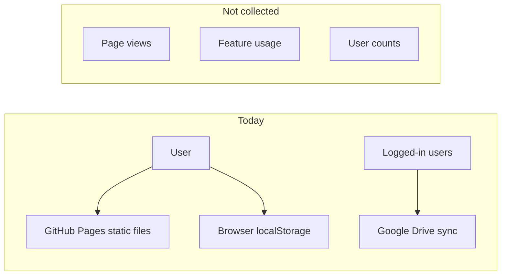
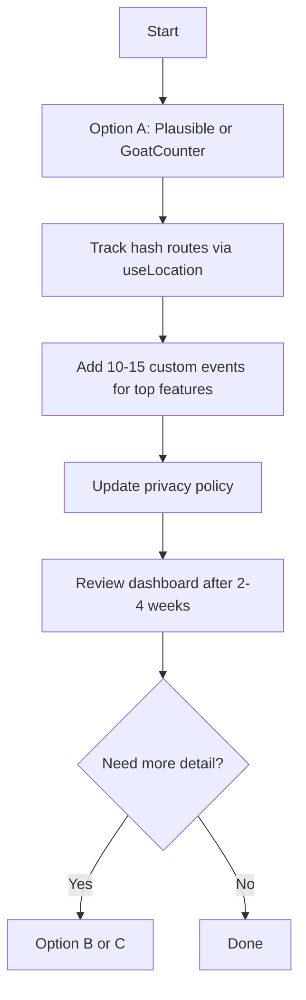

# Tunebook usage analytics options

## Current state

The app at [https://tunebook.net](https://tunebook.net) is a static React SPA on GitHub Pages with **no analytics today**:

- [README.md](README.md) and [PrivacyContent.js](src/components/PrivacyContent.js) explicitly state: *"no tracking"* and *"the owners … do not know who or how many people are using the software"*
- `web-vitals` is installed but [reportWebVitals()](src/index.js) is called with **no callback**, so performance data is discarded
- [local-resolver/server.py](local-resolver/server.py) is a user-run optional backend (pitch/tempo/chords/transcription) — not a central telemetry service
- Local-only signals exist per device (`lastUpdated` for [recent tunes](src/recentTunes.js), `localStorage` prefs) but **do not aggregate across users**

---

## What you can measure (sections)

### 1. Page / route traffic (easiest, highest value)

The app uses `HashRouter`, so URLs look like `https://tunebook.net/#/tunes/abc123`. Trackable routes from [App.js](src/App.js):

| Route pattern | Section |
|---|---|
| `/`, `/books`, `/tags` | Home / books browser |
| `/tunes`, `/tunes/:id` | Tune index and tune view |
| `/editor/:id` | ABC editor |
| `/chords`, `/chords/:instrument` | Chord lookup |
| `/metronome`, `/tuner`, `/piano` | Practice tools |
| `/print`, `/cheatsheet`, `/review` | Print / study |
| `/import`, `/importlink/...` | Import flows |
| `/recordings` | Recordings |
| `/settings`, `/help`, `/privacy` | Meta pages |

A single `useLocation()` effect can fire one anonymous `pageview` event per navigation.

### 2. Books-page subsections (custom events)

[BooksPage.js](src/pages/BooksPage.js) already defines section IDs in [recentTunes.js](src/recentTunes.js): `filters`, `recent`, `books`, `tags`. Track when users click the section nav buttons or scroll into view.

### 3. Feature-level events (deeper insight, more instrumentation)

Examples worth tracking as anonymous counts (not per-user):

- **Playback**: ABC play, media/YouTube play, playlist start
- **Editing**: open editor, save tune, transpose
- **New features on `pitchcontrol` branch**: pitch/tempo controls, lyrics transcription, chord discovery
- **Import**: source type (ABC, MusicXML, thesession, link import)
- **Auth**: login initiated / successful (count only — no email or user id)
- **Share / print**: print book, share tunebook

### 4. What you cannot get without changing architecture

- Per-user journeys or cohorts (you said anonymous aggregate only — good)
- Usage of fully offline PWA sessions after first load (unless events are queued and sent when online)
- Tune-level popularity across all users (would need server-side aggregation of tune IDs — possible but raises content-privacy questions; tune titles/IDs in events may be too granular)

---

## Options (ranked for your preference: anonymous aggregate)

### Option A — Privacy-friendly hosted analytics (recommended starting point)

**Tools:** [Plausible](https://plausible.io), [GoatCounter](https://www.goatcounter.com), [Fathom](https://usefathom.com), or [Cloudflare Web Analytics](https://www.cloudflare.com/web-analytics/) (free, very minimal)

**Pros**
- Dashboard in minutes; no backend to run
- Cookieless / GDPR-friendly options; fits "anonymous aggregate"
- Custom events for sections and features

**Cons**
- Monthly cost for Plausible/Fathom (GoatCounter has a free tier; Cloudflare is free)
- Requires privacy-policy update
- Hash-route SPA tracking needs one line of setup (all major tools support `#/` paths)

**Implementation sketch**
1. Add script snippet to [public/index.html](public/index.html) (or env-gated via `REACT_APP_ANALYTICS_*`)
2. Add a small `src/analytics.js` wrapper + `usePageAnalytics()` hook on route change
3. Call `trackEvent('feature', { name: 'pitch_tempo_used' })` at key interaction points
4. Update [PrivacyContent.js](src/components/PrivacyContent.js) to disclose anonymous usage statistics

**Effort:** ~2–4 hours for page views; +4–8 hours for meaningful feature events

---

### Option B — Self-hosted Umami or Matomo

**Pros**
- Full data ownership; can stay cookieless and anonymous
- No per-visitor SaaS fees at scale

**Cons**
- You must host and maintain it (VPS, Docker, backups)
- More ops work than Option A

**Good if:** you want dashboards without sending data to a third party.

**Effort:** half day setup + same client instrumentation as Option A

---

### Option C — Custom beacon to your own endpoint

**Pros**
- Minimal payload; you choose exactly what is collected
- Could log only coarse counters server-side (e.g. increment Redis/DB keys by route name)

**Cons**
- You build storage, dashboards, and spam protection
- GitHub Pages cannot receive POST beacons — you need a separate endpoint (Cloudflare Worker, Fly.io, extend [local-resolver](local-resolver/server.py) on a public host)

**Effort:** 1–2 days for a useful MVP

---

### Option D — Infrastructure-only (no app changes, very limited)

If `tunebook.net` DNS goes through **Cloudflare**, enable Web Analytics there for total visits and referrers — no code changes, but **no section/feature breakdown** and hash routes are poorly represented.

GitHub Pages itself provides **no** visitor analytics. Google Search Console shows search impressions, not in-app usage.

**Effort:** minutes, but low insight

---

### Option E — Indirect signals (supplement only)

- **Google Cloud Console** (OAuth client): approximate count of Google logins — not feature usage
- **GitHub repo** traffic/stars — not app usage
- **User survey** link in Help page — qualitative, not automatic

These do not replace analytics but can complement Option A.

---

## Recommended path

**Phase 1 (quick wins)**
- Pick GoatCounter (free, simple) or Plausible (nicer UX, paid)
- Track all route changes
- Track books-page section clicks

**Phase 2 (feature insight)**
- Add events for playback, editor, import, pitch/tempo, transcription, chord discovery
- Optionally wire [reportWebVitals.js](src/reportWebVitals.js) to send LCP/CLS aggregates (performance, not usage)

**Phase 3 (policy)**
- Revise [PrivacyContent.js](src/components/PrivacyContent.js) lines 22–23 and 46 to say anonymous usage stats are collected to improve the app, with no personal identification

---

## Technical notes specific to this codebase

1. **HashRouter**: use `location.pathname` + `location.hash` in a `useEffect` tied to `useLocation()` — do not rely on server access logs
2. **Env gating**: use `REACT_APP_ANALYTICS_DOMAIN` so analytics is off in local dev unless desired
3. **Offline PWA**: [sw.js](sw.js) caches assets; analytics requests should fail silently when offline (all hosted tools handle this)
4. **No PII in events**: avoid tune titles, Google emails, or document IDs in event payloads; use coarse names like `route:/tunes`, `event:media_play`
5. **Commented Google Ad slot** in [Header.js](src/components/Header.js) suggests analytics was considered before — a dedicated analytics module is cleaner than ad-based tracking

---

## Example dashboard questions you'll be able to answer

After Phase 1–2:

- How many visits per week / month?
- Top pages: `/tunes` vs `/chords` vs `/metronome`?
- Do people use the editor (`/editor`) or mostly browse/play?
- Are new pitch/tempo / transcription features getting clicks?
- Mobile vs desktop (from user-agent, aggregate)
- Referrers (search, social, direct)

You still will **not** know individual users or their tune libraries — consistent with your anonymous preference.
