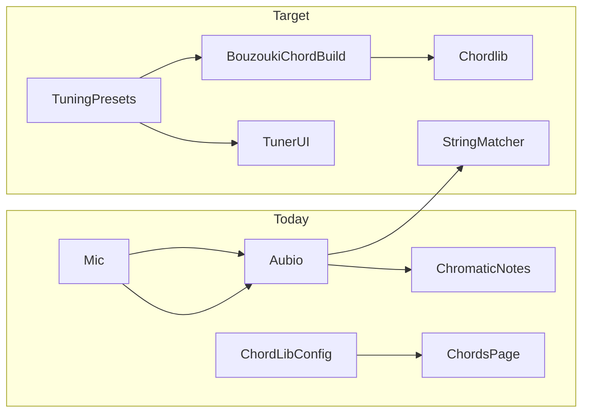

# Tuner instrument/tuning selection and bouzouki

## Current state

- Tuner lives in [`src/tunerlib/`](src/tunerlib/): chromatic pitch detection via aubio, scrollable note strip, no instrument awareness ([`TunerComponent.js`](src/tunerlib/TunerComponent.js), [`notes.js`](src/tunerlib/notes.js)).
- Chords use a single default tuning per instrument in [`src/chordLibConfig.js`](src/chordLibConfig.js) (`INSTRUMENT_TUNINGS`: guitar EADGBE, mandolin GDAE, uke GCEA, banjo4 CGDA, banjo5 gDGBD).
- Banjo/uke chord data is built in [`scripts/buildChordLib.js`](scripts/buildChordLib.js) from charts + [`src/chordVoicingGenerator.js`](src/chordVoicingGenerator.js); mandolin/guitar are hand-curated in [`src/chordlib.json`](src/chordlib.json).
- Tune metadata already has a free-text `% abcbook-tuning` field ([`src/components/AbcEditor.js`](src/components/AbcEditor.js)).

---

## 1. Shared tuning preset module

Create [`src/instrumentTuningPresets.js`](src/instrumentTuningPresets.js) as the single source of truth (imported by tuner, chord config, and build script).

**Shape per preset:**
- `id` (e.g. `gdad`)
- `label` (e.g. `GDAD (Irish)`)
- `aliases` (optional): alternate names shown in UI tooltip or subtitle (e.g. `['Calico', 'Black Mountain Rag']`)
- `strings`: low-to-high note names **with octaves** (e.g. `G2`, `D3`, `A3`, `D4`) for accurate Hz targets
- `chordTuning` (optional): letter-only array for existing chord utils (`['G','D','A','D']`)
- `tags` (optional): e.g. `['old-time', 'irish']` for future tune-metadata matching

**Instruments** (same keys as chords, plus `bouzouki`):
| Instrument | Label in tuner | Default preset |
|---|---|---|
| guitar | Guitar | standard |
| mandolin | **Fiddle/Mandolin** | gdae |
| uke | Uke | gceaHighG |
| banjo4 | 4-string banjo | cgda |
| banjo5 | 5-string banjo | openG |
| bouzouki | Bouzouki | gdad |

Update [`src/chordLibConfig.js`](src/chordLibConfig.js):
- Add `bouzouki` to `INSTRUMENTS`, `INSTRUMENT_STRINGS`, default `INSTRUMENT_TUNINGS`.
- Keep `INSTRUMENT_LABELS.mandolin` as `Mandolin` for chords; tuner uses its own label map.
- Derive `INSTRUMENT_TUNINGS` defaults from the preset module (no duplicate note lists).

**Curated preset lists** (practical “commonly used” set, not every 1-song boblit entry):

**Guitar (~12):** standard, drop D, open G, open D, DADGAD, open C, open E, double drop D, drop C, open Dm, CGDGAD, open A.

**Fiddle/Mandolin (~18)** — researched from [Wikipedia cross-tuning](https://en.wikipedia.org/wiki/Cross_tuning), [Fiddling Around cross-tuning guide](https://fiddlingaround.co.uk/cross%20tuning.html), and Fiddle Hangout discussions. Old-time names are **not universal** (e.g. “sawmill” may mean AEAE or GDGD depending on region); labels show pitch + primary name, with aliases in tooltip.

| id | Strings (low→high) | Label | Aliases / associated tunes |
|---|---|---|---|
| `gdae` | G3 D4 A4 E5 | GDAE (standard) | Italian tuning; Irish/bluegrass default |
| `aeae` | A3 E4 A4 E5 | AEAE (cross A) | Cross tuning, cross chord; Breaking Up Christmas, Cluck Old Hen, Hangman's Reel |
| `gdgd` | G3 D4 G4 D5 | GDGD (cross G) | Sawmill / cross G; Carolina Chocolate Drops repertoire |
| `aeacSharp` | A3 E4 A4 C#5 | **Calico (AEAC#)** | Black Mountain Rag, Drunken Hiccups, Lost Indian, Marcus Martin's Calico |
| `adae` | A3 D4 A4 E5 | ADAE (high bass) | Old-timey D; Liberty, Soldier's Joy, Sally Goodin |
| `ddad` | D3 D4 A4 D5 | DDAD (dead man's) | Dee-dad, Bonaparte's Retreat; Dry and Dusty, Midnight on the Water |
| `gdad` | G3 D4 A4 D5 | GDAD (gee-dad) | Flatwoods; also Irish bouzouki (shared preset strings) |
| `aead` | A3 E4 A4 D5 | AEAD (old sledge) | Old Sledge, Silver Lake |
| `gdgb` | G3 D4 G4 B4 | GDGB (G-calico) | AEAC# down a whole step; some Black Mountain Rag players |
| `gdacSharp` | G3 D4 A4 C#5 | GDAC# | Alternate Black Mountain Rag tuning |
| `fcgd` | F3 C4 G4 D5 | FCGD (Cajun) | Whole step below GDAE; accordion-friendly |
| `cgda` | C3 G3 D4 A4 | CGDA (octave mandolin) | Mandola / mandocello range |
| `edae` | E3 D4 A4 E5 | EDAE | Glory in the Meeting House |
| `eeae` | E3 E4 A4 E5 | EEAE | Get Up in the Cool |
| `gcge` | G3 C4 G4 E5 | GCGE | Over the Flatlands |
| `adfSharpE` | A3 D4 F#4 E5 | ADF#E (Huldre) | Norwegian scordatura |
| `ddae` | D3 D4 A4 E5 | DDAE (loose bass) | Norwegian lausbass; low D drone |
| `gdadLow` | G2 D3 A3 D4 | GDAD (low) | Short-scale bouzouki / octave-down variant for melody players |

**Note:** Bouzouki `gdad` and fiddle `gdad` share the same pitch classes; the preset module can reference one canonical string-octave definition and reuse it. Mandolin chord diagrams stay on GDAE default; cross-tunings are tuner-first (chord shapes differ per tuning — phase-2 tuning-aware chords).

**Uke (~6):** GCEA high G, low G, baritone DGBE, D-tuning (ADF#B), slack-key GCEG, English/baritone variant BEBE.

**4-string banjo (~5):** CGDA (current default), GDAE (Irish tenor), Chicago DGBE, plectrum CGBD, ADF#D.

**5-string banjo (~7):** gDGBD (open G), gCGCD (double C), gDGCD (sawmill/modal), gCGCE (open C), aDGBD, gDGBbD (open Gm), gCGGBD (drop C variant).

**Bouzouki (~6):** GDAD (Irish standard), GDAE (mandolin/fiddle), CFAD (Greek tetrachordo), ADAD (Greek alt), DGBE (tenor guitar), ADAD low / DAD (trichordo 3-course — include only if we model 3 strings; otherwise document as out of scope).

Add small helper [`src/tunerTuningUtils.js`](src/tunerTuningUtils.js):
- `noteNameToMidi('G2')`, `midiToFrequency(midi, a4=440)`
- `targetFrequenciesForPreset(preset, a4)`
- `nearestStringForFrequency(freq, preset, a4)` → `{ stringIndex, cents, noteLabel }`
- `harmonicTargetForOpenString(openFreq)` → expected 12th-fret harmonic frequency (2× open)
- Unit tests in [`src/tunerTuningUtils.test.js`](src/tunerTuningUtils.test.js)

Add [`src/tuningPresetResolver.js`](src/tuningPresetResolver.js) + tests:
- `resolvePresetFromText(text)` — match `tune.tuning` or URL param against preset `id`, `label`, pitch string (e.g. `GDAD`, `AEAC#`), and `aliases` (case-insensitive)
- `resolvePresetFromTuneName(tuneName)` — map known tune titles → preset (Black Mountain Rag → calico, Bonaparte's Retreat → ddad, etc.); used as fallback when `tune.tuning` is empty
- `canonicalTuningLabel(preset)` — string to write back to `% abcbook-tuning` (primary label, e.g. `GDAD (Irish)` or `Calico (AEAC#)`)

---

## 2. Tuner UI and behaviour

Refactor [`src/tunerlib/TunerComponent.js`](src/tunerlib/TunerComponent.js) into a React-controlled wrapper:

**Controls (above canvas):**
- Instrument button row — same instruments as [`ChordsPage`](src/pages/ChordsPage.js), mandolin labelled **Fiddle/Mandolin**.
- Tuning `<select>` filtered by instrument; disabled when only one preset.
- **A4 reference frequency** — editable number input (not a 440/442 toggle): default **440**, range ~400–480 Hz, step 0.1. Label `A₄ =` matching existing `.a4` CSS in [`style.css`](src/tunerlib/style.css). Changing A4 recalculates all target Hz, chromatic note strip, and meter cents. Persist to `localStorage` key `bookstorage_tuner_a4`.
- Mode toggle: **Tune** (default) | **Intonation check**

**Persistence:** `localStorage` keys `bookstorage_last_tuner_instrument`, `bookstorage_last_tuner_tuning_{instrument}`, and `bookstorage_tuner_a4`.

**String-target mode** (primary UX beyond chromatic strip):
- Show a row of string labels with target notes (e.g. `G2  D3  A3  D4`) derived from selected preset.
- Highlight active string; colour meter green when within ±5 cents of that string’s target.
- Click a string → play reference tone via existing `Tuner.play()` oscillator.
- “Next string” button + optional auto-advance when in tune.

**Wrong-string warning** (in scope):
- When user has selected/active string *N*, compare `nearestStringForFrequency(detectedFreq)` result.
- If best match is a **different** string and its cents magnitude is ≥15 cents better than the active string’s match, show a dismissible alert: *“Sounds like D₃ — are you on the A string?”*
- Suppress warning when no stable pitch (cents fluctuating) or when detected freq is far from any string (>50 cents on all).

**Intonation check mode** (in scope):
- Per-string two-step workflow:
  1. **Open string** — tune as normal until in tune (±5 cents).
  2. **12th-fret harmonic** — user lightly touches harmonic; compare detected frequency to `2 × openStringTargetHz` (12th-fret harmonic = same note one octave up).
- Show cents offset for harmonic vs expected; green within ±5 cents, amber 5–15, red beyond.
- UI copy: brief instruction (“Pluck open, then lightly touch 12th-fret harmonic”).
- No separate harmonic detector required initially — aubio pitch on the harmonic tone is sufficient; harmonic energy is weaker so use slightly relaxed stability threshold.
- “Next string” advances through all strings.

**Pitch matching:** Extend [`Application`](src/tunerlib/app.js) `onNoteDetected` to call `nearestStringForFrequency` when a preset is selected; pass `activeStringIndex`, `stringCents`, and `wrongStringWarning` to React state. Pass `a4` into `Tuner` constructor and update `middleA` when React changes it. Keep chromatic note strip as secondary feedback.

**Layout:** Wrap tuner in [`TunerPage.js`](src/pages/TunerPage.js) with Bootstrap container + heading (match [`ChordsPage`](src/pages/ChordsPage.js) styling). Accept optional URL search params (see §4).

---

## 3. Bouzouki chord data

**Approach:** Same pipeline as banjo4 — seed chart + voicing generator enrichment.

1. Add `bouzouki` to [`src/chordLibUtils.js`](src/chordLibUtils.js) `stringsFromInstrument` (4 strings).

2. Create [`src/bouzouki.gdad.chords.chart.json`](src/bouzouki.gdad.chords.chart.json) with open-position shapes for common session keys (G, D, C, A, Em, Am, Bm, etc.), sourced from widely published GDAD fingerings (Han Speek chart, session tutorials). Format matches [`src/banjo4.chords.chart.json`](src/banjo4.chords.chart.json).

3. Extend [`scripts/buildChordLib.js`](scripts/buildChordLib.js):
   - `buildBouzouki()` from chart + `generateAllVoicings('bouzouki', …)` neck alternatives.
   - Default tuning `GDAD` in `INSTRUMENT_TUNINGS`.

4. **GDAE bouzouki tuning:** Frets are identical to mandolin — build step can `deepCopy` mandolin section when generating a future `bouzouki.gdae` entry, or document that GDAE players use mandolin chord page until tuning-aware chords exist.

5. **CFAD (Greek):** Voicing-generator-only pass (no seed chart initially); shapes mirror guitar top-4 strings.

6. Run build script → update [`src/chordlib.json`](src/chordlib.json).

7. Add `bouzouki` button to [`ChordsPage`](src/pages/ChordsPage.js) instrument row; cheat sheet in [`ChordCheatSheetModal`](src/components/ChordCheatSheetModal.js) picks up new instrument automatically.

**Note:** Chord diagrams remain on each instrument’s **default** tuning for v1. Alternate tunings affect the tuner first; tuning-aware chord routing (`/chords/bouzouki/gdad/C`) is a sensible phase-2 follow-up.

---

## 4. Tune metadata sync, import wizard hints, and editor links

### 4a. Sync with tune metadata (in scope)

**Read path — opening tuner with tune context:**
- Support URL params on `/tuner`: `?tuneId={id}` and/or `?instrument={id}&tuning={presetId}`.
- [`TunerPage`](src/pages/TunerPage.js) reads `tuneId` from query, loads tune via `tunebook`, calls `resolvePresetFromText(tune.tuning)` then `resolvePresetFromTuneName(tune.name)` as fallback.
- Pre-select instrument + tuning preset when a match is found; show subtitle: *“Suggested for {tune name}”*.
- Add **“Open tuner”** link in [`AbcEditor.js`](src/components/AbcEditor.js) Info tab (near existing Tuning field) → `/tuner?tuneId={tuneId}`.

**Write path — saving tuning back to tune:**
- When user changes preset while `tuneId` is present, show non-blocking prompt: *“Save {label} to tune tuning field?”* with **Save** / **Not now**.
- **Save** writes `canonicalTuningLabel(preset)` to `tune.tuning` and persists via existing `saveTune` / `abcbook-tuning` header in [`useAbcTools.js`](src/useAbcTools.js).
- Do not auto-write without confirmation (avoid clobbering free-text user values).

### 4b. Import wizard hint (in scope)

After analysis completes in [`MediaImportWizard.js`](src/components/MediaImportWizard.js), evaluate heuristics and show a **dismissible `Alert`** on the Metadata or Finish step:

| Signal | Suggested preset |
|---|---|
| Tags/rhythm/key suggest Irish trad (jig/reel, D/G mixolydian, etc.) | bouzouki `gdad` or mandolin `gdae` |
| Tags suggest old-time / Appalachian | mandolin `aeae` or `aeacSharp` (calico) if tune name matches |
| Tune title matches `resolvePresetFromTuneName` | that preset |

Alert content: short explanation + **“Open tuner”** button linking to `/tuner?instrument=…&tuning=…` (and `tuneId` when wizard tune is saved/staged).
Dismiss state stored in wizard draft session only (not persisted).

New helper [`src/tuningSuggestionHeuristics.js`](src/tuningSuggestionHeuristics.js) + tests — pure functions over `{ name, tags, rhythm, key, meter }`.

### 4c. Deferred follow-ups (not in this work)

| Idea | Notes |
|---|---|
| Capo / transposition hint | Bouzouki GDAD + capo 5 ≡ mandolin GDAE |
| Chords page tuning param | `/chords/:instrument/:tuning/:chord` |
| Voice-command / hands-free | “Tune next string” via [`voiceCommandExecutor`](src/voiceCommandExecutor.js) |
| Analytics | Track popular instrument/tuning combos |

---

## 5. Tests and verification

- `tunerTuningUtils.test.js`: octave→Hz with custom A4; string matching; calico AEAC# targets; harmonic = 2× open frequency.
- `tuningPresetResolver.test.js`: match `GDAD`, `Calico`, `AEAC#`, `cross A`, case variants; tune-name → preset; canonical label output.
- `tuningSuggestionHeuristics.test.js`: Irish trad vs old-time detection from sample metadata.
- `chordLibBuilder.test.js`: bouzouki GDAD open G/D/C shapes parse; voicing count > 0.
- Manual: wrong-string warning when plucking adjacent string; intonation mode on one string; A4=442 shifts targets; editor link pre-fills preset; import wizard shows hint after analyze; save tuning back to tune updates Info field.

---

## 6. Files touched (summary)

| File | Change |
|---|---|
| `src/instrumentTuningPresets.js` | **New** — all presets |
| `src/tunerTuningUtils.js` + `.test.js` | **New** — frequency/string/harmonic helpers |
| `src/tuningPresetResolver.js` + `.test.js` | **New** — text/tune-name → preset |
| `src/tuningSuggestionHeuristics.js` + `.test.js` | **New** — import wizard hints |
| `src/chordLibConfig.js` | Add bouzouki; derive defaults from presets |
| `src/tunerlib/TunerComponent.js` | Full UI: modes, A4 input, warnings, intonation |
| `src/tunerlib/app.js` | Preset + a4 + callbacks |
| `src/pages/TunerPage.js` | Page chrome, URL param handling |
| `src/components/AbcEditor.js` | “Open tuner” link near tuning field |
| `src/components/MediaImportWizard.js` | Dismissible tuning suggestion alert |
| `src/bouzouki.gdad.chords.chart.json` | **New** — seed shapes |
| `scripts/buildChordLib.js` | Build bouzouki section |
| `src/chordlib.json` | Regenerated |
| `src/chordLibUtils.js`, `src/pages/ChordsPage.js` | bouzouki registration |
