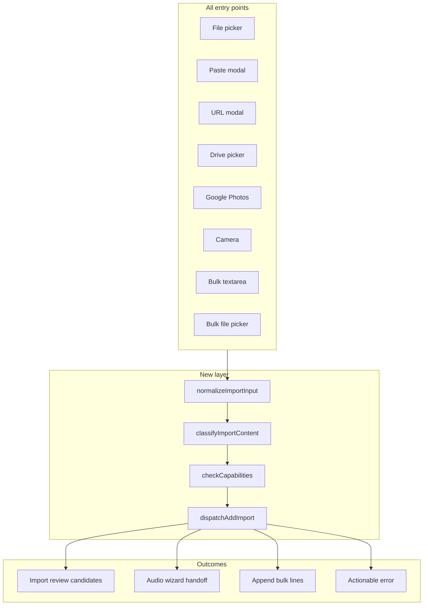
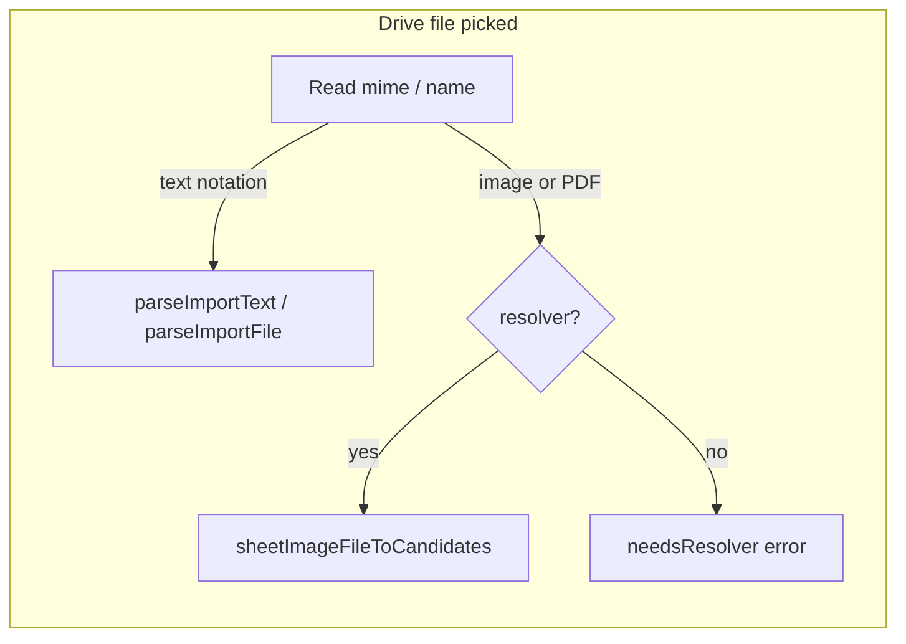

# Unified Add Import Dispatch

## Problem

Add-form import logic is split across many handlers in [`src/components/AddSongModal.js`](src/components/AddSongModal.js) with inconsistent rules:

| Entry point | Current behavior | Gap |
|-------------|------------------|-----|
| **File** | Separate branches: audio → wizard, sheet image → `handleSheetImageFile`, notation → `parseImportFile` | Sheet images only on this path; unknown extensions rejected without sniffing |
| **Paste** | Always `parseImportText` | Single-line URLs not fetched; no sheet-image/data-url handling |
| **URL** | `fetchImportSourceFromUrl` → `candidatesFromImportSource` | [`fetchImportSourceFromUrl`](src/importSourceParse.js) only treats **mxl/midi** as binary; image/PDF URLs and Drive images are not transcribed |
| **Drive** | Text → `parseImportText`; images → separate `onFile` → `handleSheetImageFile` | Duplicates paste/file logic; image path missing when resolver off |
| **Camera / Google Photos** | Direct `handleSheetImageFile` | Bypasses shared classification |
| **Bulk textarea** | Always `bulkLinesToCandidates` | ABC/notation dumps create empty shell tunes instead of real imports |
| **Bulk file** | Text → append lines; audio → wizard | Notation/audio-only files in bulk not routed to review |

[`candidatesFromImportSource`](src/importSourceParse.js) (used by URL modal) never routes sheet images to transcription even though that is the natural central place.



## Capability rules (single source of truth)

Encode once in the new module and reuse everywhere:

- **Offline OK**: ABC, chord sheets, local MusicXML/MXL, plain text notation
- **Resolver required**: MIDI, sheet images/PDFs (file, URL, camera, **Google Photos only**), resolver-backed score conversion, bulk-line formatting via resolver
- **Google login required to act**: Drive picker/URLs (cannot fetch without OAuth), Google Photos picker
- **Google login NOT required to queue**: audio upload-to-Drive — always offer the option in UI; selections set `uploadPending` on links via [`createAttachedAudioLink`](src/linkRecording.js) and upload when the user signs in later
- **Best-effort**: always try the highest-fidelity path allowed by current context; if blocked, return a specific error (`needsResolver`, `needsGoogleLogin`) rather than a generic “unsupported”

### UI visibility vs processing (explicit)

| Control | Visible when | Notes |
|---------|--------------|-------|
| **File / Paste / URL** | Always | Accept list still gated by resolver for MIDI/images |
| **Record** | Always | |
| **Camera** | Resolver available | Sheet transcription only |
| **Google Photos** | **Resolver available only** | Button hidden when `!resolverAvailable` (even if logged in). No fallback to show disabled. |
| **Drive import** | Google logged in | Opens picker / paste-link fallback; **does not require resolver** for text, ABC, chord, MusicXML, MXL imports |
| **Upload to Drive** (audio modal) | **Always** when audio import runs | [`AudioDriveUploadModal`](src/components/AudioDriveUploadModal.js) checkboxes stay available logged out; copy explains upload queues until sign-in |

**Drive picker is not resolver-gated.** Only sheet-image/PDF files picked from Drive need the resolver for transcription. Other Drive file types follow the normal notation/text import path. If a user picks an image/PDF without a resolver, dispatch returns a clear resolver error — it does not block or hide the Drive button.




## Implementation

### 1. New module: [`src/addImportDispatch.js`](src/addImportDispatch.js)

Core exports:

- **`buildImportContext(opts)`** — `{ resolverAvailable, googleLoggedIn, accessToken, driveApi, tunebook, abcjsParser, book }`
- **`normalizeImportInput(input)`** — accept `File`, `{ file }`, `{ text, fileName?, sourceUrl? }`, raw `string`, `{ url }`; produce a canonical payload
- **`classifyImportContent(payload, ctx)`** — returns one of: `audio`, `sheetImage`, `notation`, `url`, `bulkList`, `unknown`
  - Text heuristics: single-line `https?://` → `url`; `X:` / MusicXML / chord detect → `notation`; multi-line without `X:` matching [`parseBulkLine`](src/bulkListFormat.js) → `bulkList`
- **`dispatchAddImport(input, ctx)`** — async; returns a discriminated result:
  - `{ action: 'review', candidates }`
  - `{ action: 'audio', files: File[] }`
  - `{ action: 'bulkAppend', text }` (bulk tab only)
  - `{ action: 'error', message, needsResolver?, needsGoogleLogin? }`

Classification order for files (best-effort):

1. Audio → audio handoff
2. Sheet image (if resolver) → transcribe
3. Known notation extension → `parseImportFile`
4. Unknown extension → read as text and run `detectTextImportFormat`; if still unknown and resolver on, try sheet-image transcription as last resort

### 2. Extend [`src/importSourceParse.js`](src/importSourceParse.js)

- Add **`sheetImageFileToCandidates(file, options)`** — move transcription + [`createTuneFromSheetImageImport`](src/sheetImageImportUtils.js) here (today duplicated in AddSongModal `handleSheetImageFile`)
- Update **`fetchDriveImportSource`** and **`fetchImportSourceFromUrl`** to return `{ file }` for images/PDFs (by extension, Drive mime, or HTTP `Content-Type`), not only mxl/midi
- Update **`candidatesFromImportSource`**:
  - If `source.file` is a sheet image and resolver available → `sheetImageFileToCandidates`
  - If sheet image but no resolver → throw clear resolver error (Drive/URL/file paths only; Photos button never shown)
  - Else existing `parseImportFile` / `parseImportText` paths — **no resolver needed**
- Add **`classifyTextImport(text)`** and **`looksLikeBulkListText(text)`** helpers (used by dispatch + bulk tab)

### 3. Thin [`src/components/AddSongModal.js`](src/components/AddSongModal.js)

Replace `handleAddFileSelected`, `handlePasteImportText`, `handleUrlImportSource`, `handleDriveImportText`, `handleDriveSheetImageFile`, `handleSheetImageFile` with one async **`runAddImport(input, { bulkMode? })`**:

```javascript
const result = await dispatchAddImport(input, importContext)
if (result.action === 'review') startImportReview(result.candidates)
else if (result.action === 'audio') { /* existing AudioDriveUploadModal flow */ }
else if (result.action === 'bulkAppend') appendBulkLines(result.text)
else setImportError(result.message)
```

Wire all buttons/modals to `runAddImport`:

- File / Camera / Google Photos / Drive → pass `File` or fetched source
- Paste → pass `string`
- URL modal → pass loaded source object (unchanged externally)
- **Bulk Import** button → `dispatchAddImport(bulkText, { ...ctx, bulkMode: true })` so notation dumps go to review, list lines append or review as today
- **Bulk file** picker → per-file `dispatchAddImport`; audio batches still coalesce into one wizard when multiple audio files

Keep UI-specific concerns (busy state, progress bar, recording) in AddSongModal; keep content rules in dispatch.

**UI rules in AddSongModal (not dispatch):**

- Google Photos button: render only when `resolverChecked && resolverAvailable`
- Drive import button: render when `props.token` (unchanged — picker needs OAuth)
- Audio import path: always open `AudioDriveUploadModal` with upload checkboxes enabled regardless of `props.token`; pass `loggedIn` only for copy, never to hide upload controls
- Verify [`AudioDriveUploadModal`](src/components/AudioDriveUploadModal.js) does not disable checkboxes when logged out (today they are enabled; keep it that way)


### 4. Simplify [`src/components/DriveFilePickerModal.js`](src/components/DriveFilePickerModal.js)

Replace split `onFileText` / `onFile` with optional single **`onImportSource(source)`** callback (keep old props as thin wrappers for backward compat if used elsewhere). Internally always build `{ text, fileName }` or `{ file, fileName }` and deliver one shape to dispatch — **do not branch on resolver in the picker**; let `dispatchAddImport` / `candidatesFromImportSource` decide sheet-image vs notation handling.

### 5. [`src/components/ImportUrlModal.js`](src/components/ImportUrlModal.js)

No UX change; benefits automatically when `candidatesFromImportSource` handles sheet images. Optionally call `dispatchAddImport` in `handleImport` for identical error messages.

### 6. Tests in [`src/addImportDispatch.test.js`](src/addImportDispatch.test.js) and extensions to import source tests

- Text classification: URL vs ABC vs bulk list
- Capability gating: sheet image without resolver, Drive URL without login
- `candidatesFromImportSource` with image `File` mock (transcription mocked)
- `fetchImportSourceFromUrl` returns file for `.pdf` / `image/*` content-type

## Out of scope (kept minimal)

- Multi-page sheet capture workflow (removed from toolbar earlier); single image/PDF per import remains
- Clipboard image paste (no `read()` image API in Paste modal today); can add later if browser supports it
- Changing bulk tab’s primary purpose as a title/artist/link list editor

## Files touched

| File | Change |
|------|--------|
| `src/addImportDispatch.js` | **New** — normalize, classify, dispatch |
| `src/addImportDispatch.test.js` | **New** — unit tests |
| `src/importSourceParse.js` | Sheet image in URL/source pipeline; text classify helpers |
| `src/components/AddSongModal.js` | Thin handlers → `runAddImport` |
| `src/components/DriveFilePickerModal.js` | Unified `onImportSource` delivery |
| `src/components/ImportUrlModal.js` | Optional error-message alignment |
