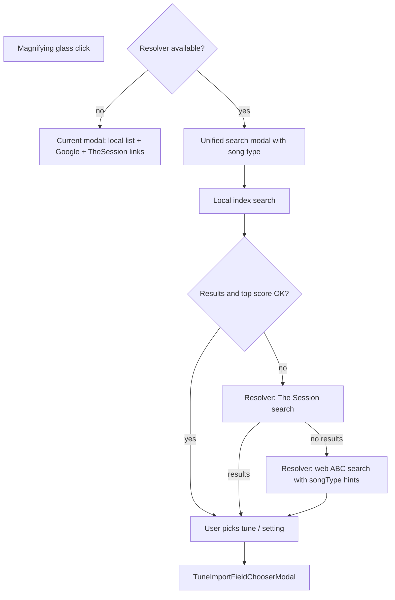

# Unified notation search in edit view

## Current behavior

- Edit toolbar ([`src/components/MusicEditor.js`](src/components/MusicEditor.js)) opens [`LocalSearchSelectorModal`](src/components/LocalSearchSelectorModal.js) via the magnifying-glass button.
- That modal shows **two external-link buttons** (Google ABC search, The Session) plus a **local inverted-index list** from [`useTextSearchIndex.searchIndex`](src/useTextSearchIndex.js).
- Picking a local tune → setting previews → [`TuneImportFieldChooserModal`](src/components/TuneImportFieldChooserModal.js) merge dialog (good).
- [`TheSessionSearchSelectorModal`](src/components/TheSessionSearchSelectorModal.js) exists but is commented out; it saves directly without the merge dialog.
- Resolver already powers chords/lyrics via `POST /search-chords` and `POST /search-lyrics` ([`local-resolver/server.py`](local-resolver/server.py)); **no notation/ABC endpoint exists yet**.
- [`ChordsSearchButton`](src/components/ChordsSearchButton.js) is the UX pattern to mirror: `useMediaResolverHealth()` → single action when available, external Google link when not.



## Target behavior (resolver available)

1. **Single primary action** in the search modal (no separate Google / The Session buttons).
2. **Waterfall search** on open or on “Search” (pre-filled with tune title):
   - Search local static index.
   - **Cascade** when results are empty **or** best match score is below a relevance threshold (your choice).
   - Stage 2: resolver searches [thesession.org](https://thesession.org) JSON API.
   - Stage 3: resolver web-searches for ABC notation (query like `abc notation "Wild Rover"`).
3. **Same merge dialog** for every source path (local setting, Session setting, fetched ABC page).
4. **Song type selector** in the search modal (`song` | `instrumental` | `traditional tune`) — passed to the resolver and used to shape web-search queries (especially stage 3).
5. **Streaming progress** — `SearchProgressBar` updates continuously from NDJSON progress events during resolver stages; local stage emits short client-side progress messages so the waterfall never feels idle.
6. Show **disambiguation** (`SearchResultPickerModal`) for multi-candidate remote stages—same as chords search.

## Target behavior (resolver unavailable)

Keep today’s modal unchanged: local index list + Google + The Session external links.

---

## Backend: new resolver endpoint

Add [`local-resolver/notation_fetch.py`](local-resolver/notation_fetch.py) (name flexible) modeled on [`chords_fetch.py`](local-resolver/chords_fetch.py) and [`lyrics_fetch.py`](local-resolver/lyrics_fetch.py):

| Stage | Implementation |
|-------|----------------|
| The Session search | `GET https://thesession.org/tunes/search?format=json&q=...` → candidate list `{id, title, type, source: 'thesession.org'}` |
| The Session detail | `GET /tunes/{id}?format=json` → map each `settings[]` entry to `{abc, key, title, sourceUrl}` |
| Web ABC search | Reuse existing search backends from `tune_background_research` / `chords_fetch` (Brave, SearXNG, Bing RSS). Query templates vary by `songType` (see below). Always include `abc notation "{title}"`; add type-specific terms for stage 3. |
| ABC extraction | Fetch candidate URLs; parse `X:`/`K:` blocks from HTML or raw `.abc` (start with abcnotation.com, folkinfo, norbeck mirrors; fail gracefully) |

Response shape (consistent with chords/lyrics clients):

```json
{
  "multiple": true,
  "candidates": [
    { "abc": "...", "title": "...", "source": "thesession.org", "sourceUrl": "...", "preview": "..." }
  ]
}
```

### Request payload

```json
{
  "title": "Wild Rover",
  "artist": "",
  "songType": "song"
}
```

`songType` is one of: `song`, `instrumental`, `traditional_tune` (snake_case in API; human labels in UI).

### Stage 3 query hints by song type

| `songType` | Extra search terms (appended to `abc notation "{title}"`) |
|------------|-----------------------------------------------------------|
| `song` | `lyrics`, `folk song`, `ballad` |
| `instrumental` | `instrumental`, `tune`, `melody` (no lyrics bias) |
| `traditional_tune` | `traditional`, `irish tune`, `folk tune`, `session tune` |

Run 2–3 query variants per type (primary + `site:abcnotation.com` + `site:thesession.org` where appropriate). Emit a progress event before each query attempt so the bar advances smoothly.

### Streaming progress (required)

Wire `POST /search-notation` in [`local-resolver/server.py`](local-resolver/server.py) with **NDJSON streaming** (same pattern as `/search-chords` and `/search-lyrics`):

- Client sends `Accept: application/x-ndjson`.
- Server yields events: `{ "type": "progress", "stage": "thesession"|"web", "message": "...", "progress": 0.0–1.0 }` then `{ "type": "result", "body": {...} }`.
- Emit progress at meaningful steps: starting Session search, parsing Session results, fetching tune detail, starting web search, each query variant, fetching/parsing each candidate URL.
- On error: `{ "type": "error", "message": "...", "status": 4xx/5xx }`.

Add tests in `local-resolver/test_notation_fetch.py` (mock httpx responses for Session JSON + one ABC HTML page; assert progress events are emitted in order).

Update [`local-resolver/README.md`](local-resolver/README.md) and endpoint list in server health JSON.

---

## Frontend: client + modal refactor

### New client

[`src/notationSearchClient.js`](src/notationSearchClient.js) — copy structure from [`src/chordsSearchClient.js`](src/chordsSearchClient.js):

- `searchNotation({ title, artist, songType, accessToken, onProgress })`
- **Always request NDJSON** (`Accept: application/x-ndjson`) and pipe every `progress` event to `onProgress(message, progress, stage)` — do not wait for the final result before updating UI.
- Normalize to `{ multiple, candidates[] }` where each candidate includes `abc` text
- Register path in [`src/mediaProxyClient.js`](src/mediaProxyClient.js) analytics mapping

### Enhance `LocalSearchSelectorModal`

This component is already reused in edit view, Add Tune, and Media Import notation step—implement unified behavior here so all call sites benefit.

Key changes in [`src/components/LocalSearchSelectorModal.js`](src/components/LocalSearchSelectorModal.js):

- Import `useMediaResolverHealth`, `SearchProgressBar`, `SearchResultPickerModal`, `searchNotation`.
- Accept optional `token` prop (pass from [`MusicEditor`](src/components/MusicEditor.js), [`AddSongModal`](src/components/AddSongModal.js), [`NotationStep`](src/components/mediaImportWizard/NotationStep.js)).
- Add **song type selector** (`Form.Select` or radio group) with three options:
  - **Song** — vocal / lyric folk songs
  - **Instrumental** — melodies without lyrics focus
  - **Traditional tune** — session tunes, reels, jigs, etc.
- **Default song type** from `currentTune.rhythm` when available (e.g. reel/jig/hornpipe/slip jig → `traditional_tune`; waltz/ballad/song → `song`; ambiguous → `instrumental`). User can override before searching.
- **When `resolverAvailable`:**
  - Remove Google / The Session `<a>` buttons.
  - Add one **Search** button (or auto-run when modal opens with non-empty filter).
  - Show `SearchProgressBar` for the **entire waterfall** (local + remote):
    1. Client: `onProgress('Searching local collection…', 0.05, 'local')` → `searchIndex(filter)` → evaluate threshold.
    2. If weak/empty: `searchNotation({ title, artist, songType, onProgress })` — forward every streamed resolver event to the progress bar (map resolver `progress` 0–1 into overall 0.1–1.0 range so the bar moves throughout).
  - Remote candidates → `SearchResultPickerModal`; Session tunes with multiple settings → existing “Pick a setting” sub-view.
  - Every selection → `beginImport(abc)` → existing `TuneImportFieldChooserModal`.
- **When resolver unavailable:** keep current UI verbatim (no song type selector required unless useful for external Google link query — optional, low priority).

### Merge dialog polish

[`TuneImportFieldChooserModal`](src/components/TuneImportFieldChooserModal.js): add optional `sourceLabel` prop so title reads “Import from The Session” / “Import from web” instead of hard-coded “Import from collection”.

### The Session → tune JSON

Convert fetched ABC with existing `tunebook.abcTools.abc2json(abc)` (already used in `beginImport`). Preserve current tune `id`, `books`, `tags` inside merge utils / save path—not direct overwrite like old `TheSessionSearchSelectorModal.selectSetting`.

---

## Local index relevance improvements

Root causes of “too long / poorly aligned” lists in [`useTextSearchIndex.searchIndex`](src/useTextSearchIndex.js):

1. **Union semantics** — any single token hit includes a tune (OR), so common words inflate results.
2. **Score bug** — `seen[lowerName].score` is overwritten per duplicate id; sorting uses two competing `sort()` passes (first ascending, then descending).
3. **High cap** — `slice(0, 200)` returns far more than users can scan.
4. **Weak token weighting** — no IDF; short tokens like “reel” match many tunes.
5. **Index/query asymmetry** — index lowercases tokens at build time ([`indexes_from_files.js`](abcresources/indexes_from_files.js) uses `stripText` → lowercase) but runtime scoring re-counts title substrings inconsistently.

### Recommended scoring changes (implement in `searchIndex`)

| Change | Effect |
|--------|--------|
| **Require token coverage** | For multi-word queries, rank by `matchedQueryTokens / totalQueryTokens`; hide results below e.g. 50–75% unless query is single-token. |
| **AND-first, OR-fallback** | Prefer tunes matching all query tokens; only widen to partial matches if AND set is empty. |
| **Fix sort** | Single comparator: higher score first, then shorter title distance, then alphabetical. |
| **Minimum score gate** | Export `topScore` + `isStrongMatch(query, topResult)` for cascade threshold (e.g. require all tokens in title OR score ≥ 2 for 2+ token queries). |
| **Lower cap** | Show top **25** in UI (keep 50 internal for disambiguation). |
| **Exact / prefix boost** | +3 exact normalized title match; +2 if title starts with query; +1 per token in order. |
| **Penalize single-token-only hits** | When query has 2+ tokens, demote tunes that only matched one rare token. |
| **Surface metadata in list** | Show collection source (thesession, norbeck, …) from id prefix `collectionNumber-file-tuneKey` to help user judge relevance. |

Extract pure scoring helpers into e.g. [`src/textSearchIndexUtils.js`](src/textSearchIndexUtils.js) with unit tests (mirror [`src/tuneImportMergeUtils.test.js`](src/tuneImportMergeUtils.test.js) style) so threshold logic is testable without loading the full index.

**Rebuild note:** tokenization changes in runtime scoring do not require re-running `indexes_from_files.js` unless you also change index tokenization (e.g. add aliases from `N: AKA:` lines—that would be a separate, optional index rebuild).

---

## Cascade threshold (concrete default)

Use a shared helper `isStrongLocalMatch(query, results)`:

- **Strong** if `results.length > 0` AND (
  - normalized title equals normalized query, OR
  - `top.score >= queryTokenCount` AND `top.matchedTokenCount === queryTokenCount`
)
- **Weak** otherwise → run resolver stages 2–3 automatically and show combined remote results (or replace local list with remote if local was empty).

Tune threshold constants in one place (`LOCAL_SEARCH_MIN_SCORE`, `LOCAL_SEARCH_MIN_TOKEN_COVERAGE`) for easy adjustment after manual testing with tunes like “The Wild Rover”, “Drowsy Maggie”, “Si Bheag Si Mhor”.

---

## Files touched (summary)

| Area | Files |
|------|-------|
| Resolver | `local-resolver/notation_fetch.py`, `server.py`, `test_notation_fetch.py`, `README.md` |
| Client | `src/notationSearchClient.js`, `src/notationSearchClient.test.js`, `src/mediaProxyClient.js` |
| Search UX | `src/components/LocalSearchSelectorModal.js`, `src/components/TuneImportFieldChooserModal.js` |
| Local scoring | `src/useTextSearchIndex.js`, `src/textSearchIndexUtils.js` (+ test) |
| Props | `src/components/MusicEditor.js`, `src/components/AddSongModal.js`, `src/components/mediaImportWizard/NotationStep.js` |

---

## Test plan

1. **Resolver off** — edit view search modal still shows Google + The Session links and local list only.
2. **Resolver on, strong local hit** — search “Drowsy Maggie” (or similar indexed tune); local results only, no remote calls; merge dialog works.
3. **Resolver on, weak local hit** — obscure title; progress bar streams messages through local → Session → web stages; picker appears; merge dialog imports selected fields only.
4. **Song type affects stage 3** — same title with `song` vs `traditional tune` produces different web query variants (verify in resolver tests).
5. **Session multi-setting tune** — picker → setting preview → merge dialog.
6. **Media import notation step** — `onStageImport` path still receives merged melody notes.
7. **Unit tests** — scoring helper thresholds; notation_fetch Session + ABC parse mocks; song-type query builder; NDJSON progress event ordering.
