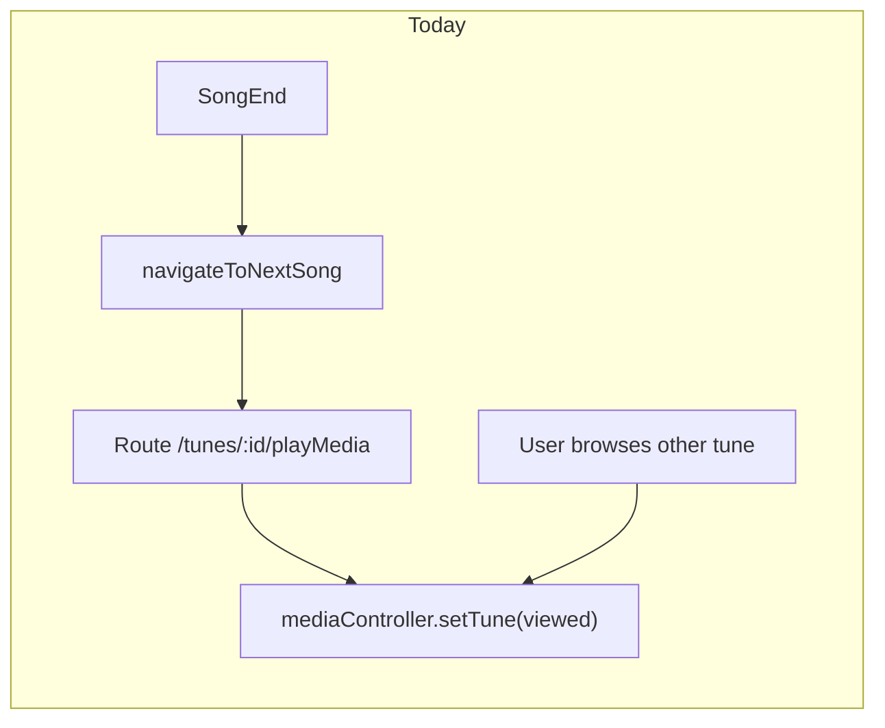
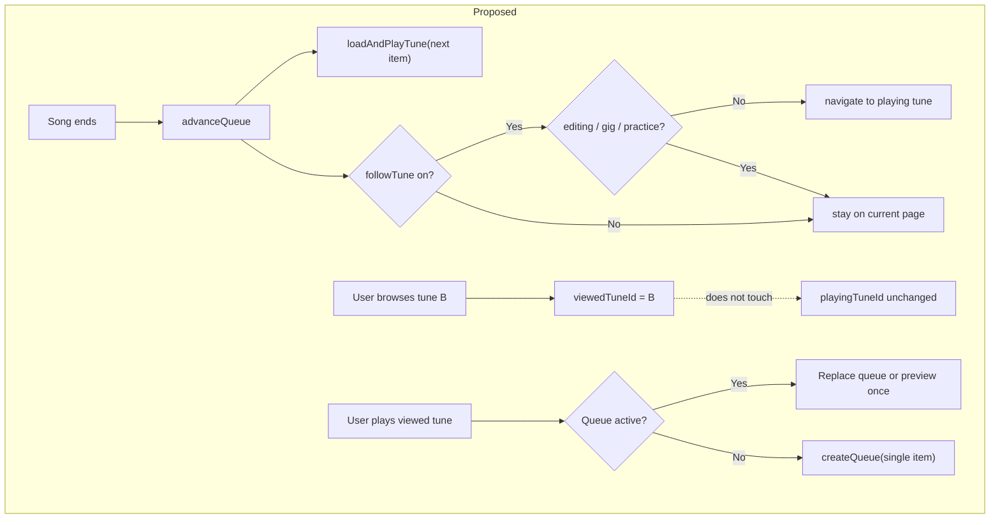

# Unified Now Playing Queue

## Problem today

The app has **four overlapping concepts** that users experience as "playlist":

| System | Where | Continuous play? | Survives browsing? |
|--------|-------|------------------|-------------------|
| Search/filter list | implicit in [`navigateToNextSong`](src/useTuneBook.js) fallback | Only if you stay on a playing tune route | No — advances force `navigate('/tunes/:id/play…')` |
| `mediaPlaylist` / `abcPlaylist` | [`useAppData.js`](src/useAppData.js), [`PlaylistModal`](src/components/PlaylistModal.js) | Yes, on song end | No — route changes hijack `mediaController.setTune` via [`MusicSingle`](src/components/MusicSingle.js) |
| `generateCurrentPlaylist` | [`generateCurrentPlaylist.js`](src/generateCurrentPlaylist.js) | No — only tags tunes + sets filter | N/A (not a queue) |
| `setPlaylist` (Gig Mode) | [`GigModeModal`](src/components/GigModeModal.js), [`SetsPage`](src/pages/SetsPage.js) | Yes, navigates each tune | **Stays separate** per your preference |

Additional blockers for background play:

- [`Header.js`](src/components/Header.js) clears `mediaPlaylist`/`abcPlaylist` when clicking the Tunes button.
- [`MusicSingle`](src/components/MusicSingle.js) always calls `mediaController.setTune(viewedTune)` on route change, overwriting whatever is playing.
- [`navigateToNextSong`](src/useTuneBook.js) always navigates; there is no “advance queue only” path.



## Recommended direction: one ephemeral queue + playback/view split

### Core model — `nowPlayingQueue` in [`useAppData.js`](src/useAppData.js)

Replace `mediaPlaylist` + `abcPlaylist` with a single store (new module [`src/nowPlayingQueue.js`](src/nowPlayingQueue.js)):

```js
{
  id: string,
  name: string,              // e.g. "Selection", "Irish Set", tag name
  source: 'selection' | 'filter' | 'tag' | 'manual',
  items: [{ tuneId, prefer: 'auto' | 'media' | 'midi' }],
  currentIndex: number,
  autoAdvance: true,         // user-toggle; when false, stop at end of track
  loop: false,               // optional wrap at end
  followTune: false           // default off — browse freely; when on, navigate to next tune on song end
}
```

Helpers: `createQueueFromSelection`, `createQueueFromFilter`, `advanceQueue`, `clearQueue`, `getCurrentItem`, `resolvePlaybackForItem(tune)`.

**Gig Mode (`setPlaylist`) stays untouched** — separate state, separate UI, separate advance logic in `navigateSetPlaylistStep`.

### Playback vs view (the key architectural change)

Split what the user **sees** from what is **playing**:

| Concept | Source | Used by |
|---------|--------|---------|
| `viewedTuneId` | React Router `params.tuneId` | [`MusicSingle`](src/components/MusicSingle.js), editor, sheet display |
| `playingTuneId` | `nowPlayingQueue.items[currentIndex]` | [`useTuneBookMediaController`](src/useTuneBookMediaController.js), header transport |

Changes:

1. **`MusicSingle`**: stop unconditionally calling `mediaController.setTune` on route change when a queue is active. Only update a lightweight `viewTune` ref/state for display; leave playback tune on the controller unless the user explicitly plays the viewed tune.
2. **`useTuneBookMediaController`**: on queue advance, call internal `loadAndPlayTune(tuneId, route)` without `navigate()`.
3. **`navigateToNextSong` / `onEnded`**: if `nowPlayingQueue.autoAdvance` and queue active → `advanceQueue()` + start playback on the next item. **Browsing during playback never changes the playing tune.** On song end, call `navigate('/tunes/:id/play…')` **only when** `followTune` is true **and** auto-navigate is not suppressed (see below).
4. **Mount playback UI globally**: ensure [`MediaPlayerMedia`](src/components/MediaPlayerMedia.js) / MIDI host can render from header-level context when viewed tune ≠ playing tune (likely a small [`NowPlayingHost`](src/components/NowPlayingHost.js) mounted at app/header level).

### Follow tune behavior

`followTune` is a user-facing checkbox at the **top of the playlist dialog** (not a separate settings screen). Default **off**.

| `followTune` | User browses to another tune during playback | On song end |
|--------------|-----------------------------------------------|-------------|
| **off** (default) | Fine — viewed page changes, audio keeps playing current queue item | Advance queue + play next track **in background**; page stays wherever user navigated |
| **on** | Fine — same as above while track is playing | Advance queue + play next track **and** navigate page to that tune |

**Suppress auto-navigate on song end** even when `followTune` is on:

- User is in the **editor** (`/editor/…`)
- **Gig Mode** is active (`setPlaylist` open / gig route)
- **Practice session** is active
- User is on a route where following would be disruptive (e.g. print view) — audit as needed

Browsing itself never toggles `followTune` and never stops the queue.



### Manual play conflict (your choice: confirm first)

When queue is active and user presses Play on the **viewed** tune ([`startTunePlayback`](src/tunePlaybackActions.js) / header play):

Show a small modal/toast with three actions:

- **Replace queue** — rebuild queue from current viewed tune (or current filter/selection) and play
- **Play once (keep queue)** — temporarily play viewed tune; on end, resume queue at prior index (store `queueSuspendSnapshot`)
- **Cancel**

Implement in [`src/nowPlayingQueuePlayback.js`](src/nowPlayingQueuePlayback.js) so all entry points share one code path.

### When to stop auto-advance

| Event | Behavior |
|-------|----------|
| User presses Stop / Clear queue | `clearQueue()`, stop playback |
| User chooses “Replace queue” | new queue, old discarded |
| `autoAdvance` toggled off | play current track only |
| Queue reaches end (no loop) | stop, show “Queue finished” toast; keep list for review |
| Practice session starts | suspend queue (`queueSuspendSnapshot`), restore on session end if desired |
| Enter editor on playing tune | pause auto-advance while editing (optional v1: just pause) |
| Gig Mode starts | independent — does not clear unified queue, but playback priority goes to Gig (document precedence) |

**Remove** the behavior in [`Header.js`](src/components/Header.js) that clears playlists on Tunes nav click — replace with queue indicator only.

### Unified UI — keep what works, extend it

**Preserve the existing play-button-group pattern** in [`MediaPlayerButtons`](src/components/MediaPlayerButtons.js) + [`PlaylistModal`](src/components/PlaylistModal.js):

- When a queue is active, show the **hamburger icon** (`tunebook.icons.menu`) in the play button group — same as today.
- Hamburger **toggles** the playlist dialog (modal); variant stays warning while playing, success when paused.
- Dialog content evolves from today’s [`PlaylistManager`](src/components/PlaylistManager.js) + [`AbcPlaylistManager`](src/components/AbcPlaylistManager.js) into one unified list (per tune: play MIDI, play each media link) — **keep the per-link play buttons**.

**At the top of the playlist dialog:**

```
[ ] Follow tune — navigate to each song when it starts playing
```

Bound to `nowPlayingQueue.followTune`. Persist for the session (optional: remember in localStorage later).

**Optional now-playing label (larger screens only):**

- In [`MediaPlayerButtons`](src/components/MediaPlayerButtons.js) or [`Header.js`](src/components/Header.js), when queue is active and **not** narrow viewport (`!useIsNarrowViewport()` from [`useMediaQuery.js`](src/useMediaQuery.js)), show a compact label beside the play group: e.g. `Playing: Tune Name (3/12)`.
- **Hide on narrow screens** — hamburger + play/pause is enough; avoids crowding the header.

**Not in v1:** separate “Now Playing strip”, list-row badges, reorder/remove (can follow later).

Retire duplicate modals after migration: [`PlaylistManagerModal`](src/components/PlaylistManagerModal.js), [`AbcPlaylistManagerModal`](src/components/AbcPlaylistManagerModal.js).

### Entry points to wire up

| Current action | New behavior |
|----------------|--------------|
| List mode Play ([`MediaPlayerButtons`](src/components/MediaPlayerButtons.js) `fillAnyPlaylist`) | `createQueueFromFilter/Selection` + start playback |
| Selection play ([`SelectedItemsModal`](src/components/SelectedItemsModal.js), [`fillMediaPlaylist`](src/useTuneBook.js)) | same queue API |
| Generate button ([`IndexLayout`](src/components/IndexLayout.js) `generateCurrentPlaylist`) | **Stop mutating tags**; instead `createQueueFromRecent()` (reuse shuffle logic from [`generateCurrentPlaylist.js`](src/generateCurrentPlaylist.js) without `CURRENT_PLAYLIST_TAG`) and auto-start play. Optional later: “Save as tag…” |
| Skip buttons in header | operate on `nowPlayingQueue`, not implicit search order |
| Search-list fallback in `navigateToNextSong` | only when **no** active queue; otherwise queue wins |

### Migration / deprecation

**Phase 1 (minimal viable):**

- Add `nowPlayingQueue` store + playback/view split
- Redirect `fillAnyPlaylist`, `fillMediaPlaylist`, `fillAbcPlaylist` to queue creation
- Update `onEnded` in [`useTuneBookMediaController`](src/useTuneBookMediaController.js) and [`MusicSingle`](src/components/MusicSingle.js)
- Evolve PlaylistModal (hamburger + follow-tune checkbox + unified tune list); optional wide-screen now-playing label; manual-play confirm dialog

**Phase 2 (cleanup):**

- Remove `mediaPlaylist` / `abcPlaylist` state from [`useAppData.js`](src/useAppData.js)
- Remove `CURRENT_PLAYLIST_TAG` tag mutation from generate flow (keep export constant only if any saved data depends on it)
- Delete dead playlist components after parity check

### Files to touch (primary)

- New: [`src/nowPlayingQueue.js`](src/nowPlayingQueue.js), [`src/nowPlayingQueue.test.js`](src/nowPlayingQueue.test.js), [`src/nowPlayingQueuePlayback.js`](src/nowPlayingQueuePlayback.js), [`src/components/NowPlayingQueueModal.js`](src/components/NowPlayingQueueModal.js), [`src/components/QueuePlayConfirmModal.js`](src/components/QueuePlayConfirmModal.js)
- Core playback: [`src/useTuneBookMediaController.js`](src/useTuneBookMediaController.js), [`src/useTuneBook.js`](src/useTuneBook.js), [`src/tunePlaybackActions.js`](src/tunePlaybackActions.js)
- UI: [`src/components/MediaPlayerButtons.js`](src/components/MediaPlayerButtons.js), [`src/components/Header.js`](src/components/Header.js), [`src/components/MusicSingle.js`](src/components/MusicSingle.js), [`src/components/IndexLayout.js`](src/components/IndexLayout.js)
- State root: [`src/useAppData.js`](src/useAppData.js), [`src/App.js`](src/App.js)

### Risks and mitigations

- **YouTube / autoplay policies**: background advance still needs user-gesture recovery — reuse existing [`tapToPlay`](src/useTuneBookMediaController.js) flow on advance.
- **Stale tune objects in queue**: store `tuneId` only; resolve from `tunes` map at play time.
- **Route-sync assumptions**: audit [`playbackRouteSync.js`](src/playbackRouteSync.js) — when `followTune` is false, playback must work without URL `/playMedia` suffix on the viewed page; when `followTune` is true, existing route-sync on navigate is fine.

### Out of scope (per your choices)

- Gig Mode / Performance Sets (`setPlaylist`) — no merge; document that Gig takes playback priority when open
- Persisting queues to localStorage (can be a follow-up)
- Cross-device sync
