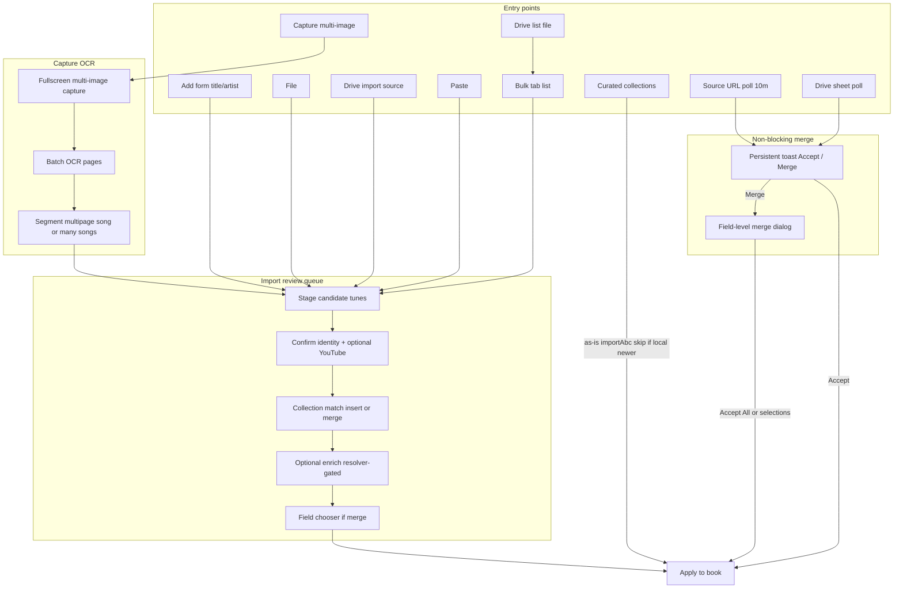

# Unify tune book import and async merge

## Current state (what we build on)

- **Add UI**: [`AddSongModal.js`](src/components/AddSongModal.js) has Add + Import tabs. Title-adjacent Search / YouTube only appear when the title is non-empty. Import tab hosts File, Sheet Image, YouTube playlist, and curated collections.
- **File import**: [`ImportFileModal.js`](src/components/ImportFileModal.js) already detects ABC / MusicXML / chord sheet / MIDI (MIDI needs resolver) and calls `importAbc` → often surfaces [`ImportWarningDialog`](src/components/ImportWarningDialog.js), which **blocks the whole app** (same pattern as Drive merge in [`App.js`](src/App.js) lines 582–591).
- **Field-level merge already exists**: [`TuneImportFieldChooserModal`](src/components/TuneImportFieldChooserModal.js) + [`tuneImportMergeUtils.js`](src/tuneImportMergeUtils.js) (used by web/local search). Reuse this for merge-on-import and source-URL updates; extend to **only show rows where `differs`** when used for async source merges.
- **Drive sync**: [`useGoogleSheet`](src/useGoogleSheet.js) polls; `onMerge` → `compareTuneBooks` → `setSheetUpdateResults` → forced [`MergeWarningDialog`](src/components/MergeWarningDialog.js). Accept applies whole-book merge; “close” currently logs out.
- **Matching**: Add tab only lists title substring matches and **opens** the existing tune (no merge).
- **Resolver gating**: [`useMediaResolverHealth`](src/useMediaResolverHealth.js) + [`resolverFeatures.js`](src/resolverFeatures.js). Pattern already used for YouTube analyze, MIDI, lyrics/chords search, etc.
- **Sheet capture today**: single frame via `SheetImageCameraModal` → one `/transcribe-sheet-image` call; no multi-page capture or multipage-vs-many-songs segmentation.

---

## 1. Shared import review pipeline

Introduce a small **import session** module (e.g. `src/importReviewSession.js` + `src/components/ImportReviewModal.js`) that owns a queue of **candidate tunes** and walks them one-by-one. All non-curated entry points feed this queue.

**Candidate shape** (minimal):

- Parsed tune fields (name, composer, links, voices, words, tempo, genre, `srcUrl`, …)
- `sourceKind` (`manual` | `abc` | `midi` | `musicxml` | `chordsheet` | `sheetimage` | `youtube` | `bulk-text` | …)
- Optional `rawText` / provenance for display

**Per-candidate steps** (bulk and single share the same modal; progress like “3 of 12”):

0. **YouTube (optional)** — if no YouTube link yet, offer add/search (reuse [`YouTubeSearchModal`](src/components/YouTubeSearchModal.js); hide search/analyze affordances when resolver unavailable).
1. **Identity** — edit title, artist, and YouTube link; prefill from source metadata (ABC `T:`/`C:`, chord sheet title, sheet OCR, MIDI/MusicXML titles via existing parsers in `ImportFileModal` / `ImportSheetImageModal` / score import).
2. **Collection match (fuzzy)** — rank existing tunes; do not require exact title/artist. Reuse existing scorers where possible ([`voiceCommandUtils.scoreTuneMatch`](src/voiceCommandUtils.js), [`textSearchIndexUtils`](src/textSearchIndexUtils.js) / `isStrongLocalMatch`, `toSearchText` normalization). Ranking signals:
   - Exact / strong title match (normalized)
   - Title + artist agreement
   - Same YouTube video id already on `links` (highest confidence)
   - **Fuzzy title**: token overlap, substring, or edit-distance-style score so an **approximate title that is the only (or clearly best) match still appears** as a merge option (e.g. “Whiskey in the Jar” vs “Whisky In The Jar”, missing “The”, extra parenthetical).
   - Show top N (e.g. 5–10) above a low threshold; label confidence (Exact / Likely / Approximate). Always offer **Create new**. Optional **Open** existing (navigate) in addition to **Merge into selected**, so we do not lose today’s “jump to tune” behavior.
3. **Enrich (optional, new tunes and merges)** — **reuse** [`AddTuneWebSearchButton`](src/components/AddTuneWebSearchButton.js) as the primary “fill missing data” action (notation → chords → lyrics → background already chained). Also offer lyrics-only, chords, local notation ([`LocalSearchSelectorModal`](src/components/LocalSearchSelectorModal.js)), and when a YouTube link is present and resolver+whisper: [`MediaImportWizard`](src/components/MediaImportWizard.js) / analyze for tempo and timed data. Run [`genreInference`](src/genreInference.js) when lyrics/chords/background arrive. **Gate resolver-dependent controls** with `useMediaResolverHealth`; import must complete without resolver.
   - **Bulk friction**: each step must support **Skip**, and the queue must support **Skip enrich for all remaining** so a 50-item playlist is not forced through enrichment.
   - **When the resolver is unavailable**, show **external-link buttons** (Google etc.) with title+artist query for lyrics, chords, notation/ABC, YouTube, background/info (same pattern as lyrics/chords fallbacks today). Prefer opening links that land the user on paste-friendly pages; keep focus on the target field when they return.
4. **Field merge** — if merge target chosen, open [`TuneImportFieldChooserModal`](src/components/TuneImportFieldChooserModal.js) (existing vs imported; only changed fields for source-URL flow; for import, show all present imported fields as today, highlighting differs). Apply via `applyTuneImportSelections` then `saveTune`. New tunes use `createTune` / `saveTune` with form book/tags.

**Multi-tune ABC / MusicXML / MIDI**: parse to N candidates → enqueue all → review one at a time. **Do not** call `showImportWarning` / `ImportWarningDialog` for these paths.

### 1a. Content-hash duplicates → toast → merge queue

When parsing/staging candidates (file, paste, Drive, bulk import, etc.), compute `getTuneImportHash` for each candidate and compare to the book’s `importhashes` index (same as today’s `importAbc` duplicate bucket).

- **Do not** silently insert a second copy, and **do not** rely only on the in-step match list.
- If any candidates match an existing tune by content hash, show a **persistent or sticky toast** (non-blocking), e.g. “N imported item(s) look like tunes already in your collection.”
- Toast actions:
  - **Review merges** (or primary action): enqueue those candidates into the **import review queue** with `mergeTarget` pre-set to the existing tune id(s) that share the hash, and open/focus `ImportReviewModal` on the field-merge step (or identity → match with the hash match pre-selected).
  - Dismiss: leave candidates out of auto-insert; user can still create new later if they insist (optional secondary “Import as new anyway” only inside the review UI, not on the toast).
- Candidates that are **not** content-hash duplicates follow the normal queue (identity → fuzzy match → enrich → field merge). Mixed batches: non-duplicates proceed; duplicates wait on the toast path or are included in the same queue already marked as merge-suggested.
- Prefer one toast per import batch (coalesce), not one toast per duplicate tune.

**Curated collections** (and share/import-by-id book links): keep **as-is** path through existing `importAbc` / `applyImportData`: update by id, skip when local is newer (`localUpdates`), no per-tune wizard. **If `localUpdates` is non-empty**, still surface a lightweight non-blocking notice (toast or inline on Bulk) so the user knows local-newer tunes were skipped—do not silently drop that information forever. Place curated UI on the Bulk tab (see below). Preserve deep links (`/importlink/…`, `/importdoc/…`, `/import/sheet-image`, etc.) by routing them into the new entry points where practical.

Extract shared **format detection + parse-to-candidates** from [`ImportFileModal.js`](src/components/ImportFileModal.js) (`detectTextImportFormat`, score/MIDI/chord paths) into something like `src/importSourceParse.js` so File, Paste, and Bulk File all use one implementation.

---

## 2. Add tab UI changes ([`AddSongModal.js`](src/components/AddSongModal.js))

Next to the Title label (always visible, not only when title has text):

| Button | Behavior |
|--------|----------|
| **File** | Local file picker (same accept list as today; MIDI only if resolver available). Parse → import review (single or queue). |
| **Drive** | Google Drive file picker (see §2b). Pick an importable source file from Drive → download → same parse/review path as **File**. Visible when logged in; request Drive scopes if needed. |
| **Capture** | Fullscreen multi-image capture modal (see §2a). **Hidden entirely when the resolver is unavailable** (no disabled stub). |
| **Paste** | Fullscreen modal: full-height textarea; top bar with blue **Paste** (`navigator.clipboard.readText`) and green **Import** when non-empty. Import runs format detection + review queue. |

Keep **Search** and **From YouTube** when title has text (existing behavior); YouTube remains resolver-gated.

### 2a. Capture: multi-image fullscreen OCR

Today [`SheetImageCameraModal`](src/components/SheetImageCameraModal.js) captures **one** frame and [`/transcribe-sheet-image`](local-resolver/server.py) processes a **single** image (PDF pages are flattened to one path in [`sheet_image_transcribe.py`](local-resolver/sheet_image_transcribe.py)). Capture becomes a dedicated **fullscreen** flow that supports many pages and feeds the shared import review queue.

**UI** (new `MultiSheetCaptureModal`, fullscreen):

- Live camera preview (reuse stream/open logic from `SheetImageCameraModal`).
- **Capture** adds a thumbnail to an ordered page strip (reorder / delete / retake).
- **Per-image song title hints** — each thumbnail in the page strip supports **one or more** optional title fields (add/remove chips or a small “+ title” control). Use cases:
  - **One title** on a page: that page belongs to that song (join with adjacent pages that share the same title).
  - **Two or more titles on one image**: the sheet contains **multiple songs on a single page**; OCR/segmenter must split that page’s content into separate candidates (one per title), using the titles as anchors/order (top-to-bottom when layout is unclear).
  - **Same title across consecutive pages**: multipage single song.
  - **No titles**: fall back to OCR title-block / continuity heuristics for those pages only.
- Hints are sent with the batch (`pages: [ { image, titles: string[] } ]`) and take **priority over automatic segmentation** when present.
- **Add from gallery** for photos already on device (same page list; title hints editable after add).
- **Google Photos** — reuse [`SheetImageGooglePhotosModal`](src/components/SheetImageGooglePhotosModal.js) / [`pickGooglePhotosAndDownload`](src/googlePhotosPickerClient.js) (already used by sheet import). Picked photos **append** to the page strip (multi-select when the Photos picker allows). Requires login + Photos Picker scope via `requestGoogleScopes`; show the same consent/error handling as today’s sheet-image Google Photos button. Not resolver-dependent for picking; transcription still needs resolver.
- Primary action **Transcribe** (enabled when ≥1 image) runs batch OCR; show progress (page N of M).
- User can keep capturing while reviewing thumbnails; camera stays open until Transcribe or Cancel.

### 2b. Google Drive file pickers

There is no Drive file-picker UI today (Drive is used for the tunebook doc and `/importdoc/:id`). Add a shared helper (e.g. `src/googleDrivePickerClient.js`) using the **Google Picker API** (or Drive file list + download via existing [`useGoogleDocument`](src/useGoogleDocument.js) read paths) so the user can choose a file they own or that is shared with them.

**Add tab — Drive:**

- Button next to File/Capture/Paste (logged-in only; hide or prompt login when not).
- Picker filters to importable types: `.abc`, `.txt`, `.xml`, `.musicxml`, `.mxl`, chord-sheet extensions, and MIDI when resolver is available; also Google Docs that export as plain text/ABC when practical.
- On selection: download file bytes/text (export Google Docs as `text/plain` when mime is a Doc), then run the same `importSourceParse` → import review queue as local **File**.

**Bulk tab — Drive:**

- Button on the Bulk toolbar (with File / YouTube / Search).
- Picker targets **text list** sources (`.txt`, `.csv`, `.tsv`, plain Google Docs, optionally `.abc` if the user wants multi-tune text in the box).
- On selection: read file contents and **populate the bulk textarea** with a list of rows in the shared line format: `Title` / `Title by Artist` / `Title | url` / `Title by Artist | url` (song required; artist and link optional). If the file is already line-oriented, load as-is (normalize line endings); if it is a simple CSV with title/artist/link columns, map columns into that format. Append when the textarea already has content (same as YouTube playlist populate).
- Does **not** auto-run Import; user reviews the list then clicks **Import**.

**Resolver batch API** (extend existing single-image endpoint):

- New `POST /transcribe-sheet-images` accepting multiple image parts plus per-page `titles[]` hints (multipart + JSON metadata), or sequential calls that pass `titles` into an extended `/transcribe-sheet-image`.
- Prefer one batch endpoint that:
  1. Runs **hint-aware** per-page transcription (see **Title hints → models** below).
  2. Joins page-regions across pages into songs.
  3. Returns `{ mode: "single_multipage" | "multiple_songs", songs: [ { title, artist, pageIndexes, chordSheet, melody, pageType, warnings, titleSource: "hint"|"ocr" } ] }`.

**Title hints → models (use titles during OCR, not only after)**

Today titles are only guessed *after* OCR (`_guess_title_artist`, optional VLM fields in [`sheet_image_vlm.py`](local-resolver/sheet_image_vlm.py)). Hints must steer the pipeline:

1. **Trust user titles for identity** — when `titles[]` is non-empty, do **not** overwrite with `_guess_title_artist`; set each song’s `name` from the hint. Spend model capacity on body text (chords/lyrics/melody), not re-discovering the title.
2. **Locate titles on the page** — after box OCR (or a cheap first pass), fuzzy-match hint strings against OCR boxes to get **y-bands**. Split the page into vertical regions (title_i → just above title_{i+1}, or page bottom). Run chord-line assembly and OMR **per region** when multiple titles are present so models are not fed a whole multi-song page as one blob.
3. **VLM / LLM cleanup prompts** — pass hints into [`maybe_apply_vlm_fallback`](local-resolver/sheet_image_vlm.py) / cleanup: e.g. “This page contains these songs in order: A, B. Return separate chord/lyric line arrays per song; do not invent other titles.” For a single-title page: “Song title is X; extract only that song’s chords/lyrics; ignore other headers if present.” Prefer forcing VLM when `len(titles) >= 2` (harder layout) even if raw OCR confidence is mediocre.
4. **Multipage join before body merge** — pages sharing one hint title are transcribed as continuations of the same song (optional prompt: “continuation of song X, page N”); concatenate chord/melody regions in page order after per-page extraction.
5. **No-hint pages** — keep current auto title guess + continuity heuristics unchanged.
6. **Weak region split fallback** — if title text is not found in OCR boxes, still emit one candidate per hint and ask VLM to partition lines by song title; if that fails, attribute full-page text to all titles in order and flag `warnings: ["title_region_uncertain"]` for review.

**Segmentation rules** (hints + model regions; user can still override in review):

1. Build songs from ordered titles across pages (a title may span pages; a page may contribute multiple titles/regions).
2. Multi-title page → one candidate per title from region/VLM split.
3. Same title on adjacent pages → join regions into one multipage song.
4. Surface `mode`, page/region ranges, `titleSource`, and uncertainty warnings before the review queue; keep lightweight overrides when the user did not supply hints.

**Downstream**: each resulting song becomes an import-review candidate (`sourceKind: 'sheetimage'`), same identity → match → enrich → field-merge path as File/Paste. Multi-song capture naturally becomes a multi-item queue (“1 of 3”).

**Gating**: **Hide Capture completely** when the resolver is not available (or sheet-image features are absent). No placeholder button. File / Drive / Paste remain.

Matching sidebar: change from “open existing” only to **select as merge target** for the current draft / staged import (wire into the same field chooser when user clicks Add or completes review). Manual Add without file still supports optional YouTube validation + match + enrich before save.

Remove the old Import-tab entry buttons (File / Sheet Image / YouTube playlist modals as primary entry). Playlist ingestion moves to Bulk’s **YouTube** button (modal → populate list with title + link rows; import review applies later).

---

## 3. Bulk tab (replaces Import tab)

Layout:

- Top button row: **File**, **Drive**, **YouTube**, and **Search** left-aligned; **Import** right-aligned.
- Full-area textarea for the staged list.
- Below (or accordion): **Curated collections** ([`ImportCollectionsAccordion`](src/components/ImportCollectionsAccordion.js)) — unchanged as-is import semantics.

Behaviors:

- **File**: load a local text-based file into the textarea (title lists, or multi-tune ABC text). Binary score files (MIDI/MXL) can either reject with a message to use Add → File, or parse immediately into the review queue without filling the textarea (prefer: text into textarea; non-text score files open review directly).
- **Drive**: Google Drive file picker for a **bulk list source** (see §2b). Read the chosen file and populate the textarea with `song` / optional `artist` / optional `link` rows. Login-required; not resolver-dependent.
- **YouTube**: opens a modal to select a playlist by pasting a **playlist URL or playlist ID** (reuse [`parseYouTubePlaylistId`](src/useYouTubePlaylist.js) / [`getPlaylistItems`](src/useYouTubePlaylist.js) from today’s [`ImportYouTubeModal`](src/components/ImportYouTubeModal.js)). On submit:
  - Fetch playlist items (YouTube Data API + login — **not** the media resolver).
  - **Populate the bulk textarea** (do not auto-save tunes). One row per video, including the watch link so identity/review already has a YouTube link. Suggested line format: `Title | https://www.youtube.com/watch?v=VIDEO_ID` (or `Title by Artist | url` when artist can be inferred; video title alone is fine when not). Append or replace: prefer **append** if the list already has content, with a clear status message (“Added N playlist items”).
  - Requires Google login / YouTube API access; show an error in the modal if not logged in or the playlist is private/empty (same failure modes as current playlist import).
- **Search**: normalize free-text rows into `Title by Artist` form (does not expand playlists — that is the YouTube button’s job). Leave existing `| url` suffixes intact when reformatting titles.
  - **When the media resolver is available**, call a **new custom resolver endpoint** (e.g. `POST /format-bulk-import-lines`) with the current textarea body. The resolver uses LLM/search heuristics (when `features.llm` or lighter rules) to return structured lines: `{ lines: [ { title, artist?, link? } ] }` (or preformatted `Title by Artist | url` strings). Client replaces the textarea with the formatted list (preserve order; keep any per-row links the resolver returns or that were already present).
  - **When the resolver is unavailable**, fall back to **local-only** normalization (split on ` - ` / ` by ` / tabs/CSV, trim, drop empties) so Bulk Search still works offline. Do not hide the Search button without resolver; only the smarter formatting path is gated.
  - Show a short busy/progress state while the resolver runs; surface resolver errors and leave the textarea unchanged on failure.
- **Import**: parse each line into candidates (title/artist, optional YouTube link from the row), then open **ImportReviewModal** for the queue. Rows that already include a YouTube URL skip the optional “add YouTube” step or prefill it. Multi-tune ABC pasted/loaded as one blob becomes N candidates.

Persist in-progress bulk text in `sessionStorage` so accidental close does not lose the list.

---

## 4. Async merge toast (Drive + source URLs) — shared UX

Drive tunebook sync and per-tune `srcUrl` updates share one non-blocking pattern. Stop gating the main app tree on `showWarning(sheetUpdateResults)` / `showImportWarning(importResults)` in [`App.js`](src/App.js).

**Persistent toast** (`autoClose: false`, `closeOnClick: false`; pattern from [`performanceSetSyncToast.js`](src/performanceSetSyncToast.js)):

| Button | Role |
|--------|------|
| Green **Accept** | Apply **all** proposed changes for this pending merge batch (same outcome as **Accept All** in the dialog). Dismiss toast. |
| Blue **Merge** | Open the **field-level merge dialog** (below). Does not apply until the user confirms in the dialog. |

No “Details-only” summary dialog; **Merge** is the interactive review. Dismissing the toast without Accept/Merge leaves local data unchanged (next poll may show the toast again unless the user chose Reject All From This Source).

**Field-level merge dialog** (shared component, e.g. `IncomingMergeModal`, built on [`TuneImportFieldChooserModal`](src/components/TuneImportFieldChooserModal.js) / [`tuneImportMergeUtils.js`](src/tuneImportMergeUtils.js)):

- Lists **every record that would change**, and for each record **only fields that differ** between current and incoming.
- Per-field checkboxes (current vs incoming display), same as today’s field chooser.
- Top actions:
  - **Accept All** — select/apply all differing fields on all records in this batch, then save and dismiss.
  - **Accept All From This Source** — same as Accept All, and persist **automatic Accept** for this source key in `localStorage` (e.g. `bookstorage_source_merge_prefs`) so future updates from that source apply silently without a toast. **Warn before enabling for the Google Drive tunebook source** (auto-accepting all remote device edits is easy to regret); source-URL auto-accept is lower risk.
  - **Reject All** — discard this pending batch (clear toast/state); do not change local data.
  - **Reject All From This Source** — Reject All, and persist **silent reject** for that source so future updates from it do not toast. Same caution for Drive.
- Source key: Google Drive tunebook document id (or a fixed `"google-drive-tunebook"` key) for sheet sync; the tune’s `srcUrl` (normalized) for source-URL polls.
- Drive-specific: inserts (new remote tunes) and deletes still appear in the dialog as whole-record accept/reject rows (no field list when the local tune is absent or being removed). Updates use per-field selection; applying a partial field set merges into the local tune rather than blindly replacing the whole object.
- **Partial-field apply and `lastUpdated`**: when the user accepts only some fields, bump local `lastUpdated` (and refresh hash) so the next Drive poll does not immediately re-offer the same remote tune as a full update. Prefer treating partial accept as “local wins for rejected fields, remote wins for accepted fields,” then upload via existing `updateSheet` path when local-side changes remain.
- **Toast spam**: coalesce pending Drive + source-URL batches into one toast when possible (“Updates available from N sources”) or a single queue indicator; avoid stacking many persistent toasts.
- Replace blocking [`MergeWarningDialog`](src/components/MergeWarningDialog.js) takeover with this toast + dialog flow.

Remove reliance on `ImportWarningDialog` for user-driven ABC/file imports (curated/share links that still use `importAbc` can auto-apply when there are no `localUpdates`; prefer silent apply for curated as-is).

---

## 5. Source URL polling (every 10 minutes)

New module e.g. `src/sourceUrlSync.js` + hook started from App when tunes are loaded:

- Collect tunes with non-empty `srcUrl`.
- Group by source URL.
- Fetch:
  - **HTTP(S) ABC/resource**: `fetch` + parse ABC (or single-tune payload).
  - **Google Doc** owned/shared with user: reuse Drive document read path from [`useGoogleDocument`](src/useGoogleDocument.js) / existing import-doc flow when `token` present; skip Google sources when logged out.
- Compare incoming tune(s) to local by id (or by matching `srcUrl` + name if id missing). Treat as update when remote `lastUpdated` is newer **or** content hash differs and remote is not older.
- Respect per-source prefs (`alwaysAccept` / `alwaysReject`) from §4; otherwise show the **same Accept / Merge toast**.

No resolver required for polling or applying merges.

---

## 6. Resolver availability rules (explicit)

| Feature | Without resolver |
|---------|------------------|
| File ABC / MusicXML / chord sheet / paste text | Works |
| Drive pickers (Add import source, Bulk list file) | Login/Drive scopes only; work without resolver |
| **Capture** | **Hidden** |
| Bulk **Search** smart formatting | Resolver endpoint when available; local heuristic fallback otherwise |
| In-app lyrics / chords / notation / background / media analyze | Replaced by **external-link search buttons** (Google etc.) with title+artist query; user pastes results |
| Bulk list import, identity, match, field merge | Works |
| Drive + source URL async merge (Accept / Merge toast) | Works |

Never block completing import because enrichment is unavailable.

---

## 7. Critique, risks, and simplifications

### What is solid

- Unifying entry points into one review queue is the right architecture; today’s split (`saveTune` vs `importAbc` vs auto-playlist save) is why behavior feels inconsistent.
- Reusing `TuneImportFieldChooserModal` / `tuneImportMergeUtils` and existing Photos / YouTube playlist helpers avoids reinventing merge and Google pickers.
- Non-blocking Accept/Merge toast fixes a real UX failure (forced merge / logout).
- Resolver-optional import with external-link fallbacks is correct for a product that must work offline.

### Problems that can arise

1. **Drive field-level merge is the hardest piece.** Today Drive applies **whole tunes** (`applyMergeChanges`). Partial fields interact with `lastUpdated`, hashes, tombstones, silent `localUpdates` upload, and multi-device races. A bug here corrupts the shared book. Mitigation: implement field-level first for **source-URL** updates (simpler, per-tune); for Drive v1, **Accept** = current whole-tune apply, and **Merge** dialog can still show field diffs but **Accept All** applies whole remote tunes (inserts/updates/deletes) until partial-field Drive apply is proven. Or ship partial-field Drive only after source-URL path is stable.
2. **Accept/Reject All From This Source on the tunebook Drive doc** is foot-gunny (auto-merge or permanently ignore another device). Mitigation: confirmation copy; easy reset in Settings.
3. **Bulk review fatigue.** Per-tune identity → match → enrich → field merge for a 100-video playlist is unusable without Skip / Skip enrich for all / optional “quick add with defaults.” Mitigation: required in §1.
4. **OCR segmentation errors** (multipage vs many songs) will be wrong sometimes. Mitigation: keep the pre-queue override (“all one song” / “each page a song”); do not over-invest in perfect LLM segmentation in v1—title-block heuristics first.
5. **New resolver endpoints** (`/format-bulk-import-lines`, `/transcribe-sheet-images`) expand surface area. Mitigation: Bulk Search local heuristics first; resolver formatting is an enhancement when `llm` is up. Batch OCR can be sequential single-image calls + client-side segmenter to avoid a big new API if needed.
6. **Google Picker** needs API key / OAuth client setup in Cloud Console; easy to break in prod. Mitigation: fall back to “paste Drive file link / doc id” using existing `/importdoc` patterns if Picker is unavailable.
7. **Toast + concurrent edits:** user keeps editing while remote changes pend; Accept may overwrite in-progress local edits on those tunes. Mitigation: on Accept, re-diff against latest local state; if local changed since toast, re-open Merge or skip those ids.

### Functionality we must not lose

| Today | Risk | Plan stance |
|-------|------|-------------|
| Open matching tune from Add sidebar | Replaced by merge-only | Keep **Open** and **Merge** |
| Import With Duplicates / content-hash duplicate visibility | Review queue may create true duplicates | See §1a: content-hash hits surface via **toast** as potential merges into the review queue |
| Curated `localUpdates` warning | Silent skip | Non-blocking notice when local-newer tunes skipped |
| Sheet-image post-OCR edit (chords/melody tabs) | Jump straight to review | Allow optional “edit transcription” before enqueue, or expose chords/notes in identity/enrich step |
| Deep links `/import/sheet-image`, chord-url, importlink | Broken routes | Route into new modals/queue |
| YouTube playlist auto book-attach by video id | Lost if only create-new | Match step must prefer existing tune with same YouTube id |
| Download tunebook / discard local (Drive) | Removed with old dialog | Keep download backup in Merge dialog footer |

### Making the most of enrichment resources

- Prefer **one** primary in-app action (`AddTuneWebSearchButton` unified search) over a wall of equivalent buttons.
- When a YouTube link exists and resolver+whisper is up, **offer analyze** (tempo, timed lyrics/chords) rather than only passive links.
- Always run **genre inference** when text arrives.
- Use **local collection + text search index** before any network call (already in web search button).
- External links are a fallback, not the main path when resolver is up.
- Do not require enrich to finish import.

### Simplicity principles (keep the implementation honest)

- **Reuse before invent:** parse helpers from `ImportFileModal`, field chooser, Photos modal, playlist fetch, `scoreTuneMatch`.
- **Phase:** (1) non-blocking Drive toast with whole-tune Accept + field-diff Merge UI that still applies whole tunes, (2) import review queue + Add/Bulk entry points + fuzzy match, (3) Capture multi-image, (4) source-URL poller with true partial-field apply, (5) partial-field Drive apply if still needed.
- **Skip paths everywhere** in the review queue.
- **Fuzzy collection match** is mandatory (see §1); implement as a small pure function with tests, not a resolver call.

---

## 8. Implementation order

1. **Non-blocking Accept/Merge toast** for Drive (whole-tune Accept; Merge dialog with field diffs + Accept All / source prefs; careful copy for Drive auto-accept). Stop gating App render.
2. **Fuzzy collection match helper** + tests; wire into Add sidebar and review queue.
3. **Extract `importSourceParse` + `ImportReviewModal` queue** (identity → match → enrich with Skip → field merge); reuse unified web search.
4. **Wire Add tab File / Drive / Capture / Paste** and Bulk tab (File / Drive / YouTube / Search / Import); curated collections; retire interactive `ImportWarningDialog`.
5. **Multi-image Capture** (Photos + segment heuristics) → review queue.
6. **Source URL poller** with shared toast and true partial-field apply.
7. **Optional:** partial-field apply for Drive updates; resolver `/format-bulk-import-lines` if local Bulk Search is insufficient.
8. Tests and helpContent.

---

## Key files to touch

- [`src/components/AddSongModal.js`](src/components/AddSongModal.js) — tabs and title actions
- New: `ImportReviewModal.js`, `importSourceParse.js`, `importReviewSession.js`, `bulkListFormatClient.js`, `PasteImportModal.js`, `MultiSheetCaptureModal.js`, `googleDrivePickerClient.js`, `sourceUrlSync.js`, `IncomingMergeModal.js`, `mergeToast.js`, external-search link helpers for enrich-without-resolver
- [`local-resolver/server.py`](local-resolver/server.py) — `POST /format-bulk-import-lines` for Bulk Search when resolver is up
- [`src/googlePhotosPickerClient.js`](src/googlePhotosPickerClient.js) / [`src/components/SheetImageGooglePhotosModal.js`](src/components/SheetImageGooglePhotosModal.js) — reuse on Capture page strip
- [`src/sheetImageTranscriptionClient.js`](src/sheetImageTranscriptionClient.js) — batch multi-image client
- [`local-resolver/sheet_image_transcribe.py`](local-resolver/sheet_image_transcribe.py) / [`local-resolver/server.py`](local-resolver/server.py) — batch endpoint + page segmentation (`single_multipage` vs `multiple_songs`)
- [`src/components/SheetImageCameraModal.js`](src/components/SheetImageCameraModal.js) — extract shared camera helpers for multi-capture
- [`src/components/TuneImportFieldChooserModal.js`](src/components/TuneImportFieldChooserModal.js) — `onlyDiffering` prop
- [`src/components/MergeWarningDialog.js`](src/components/MergeWarningDialog.js) / [`src/App.js`](src/App.js) — toast, stop UI takeover
- [`src/components/ImportFileModal.js`](src/components/ImportFileModal.js), [`ImportYouTubeModal.js`](src/components/ImportYouTubeModal.js), [`ImportSheetImageModal.js`](src/components/ImportSheetImageModal.js) — become thin wrappers or be inlined into Add/Bulk entry points
- [`src/useTuneBook.js`](src/useTuneBook.js) — stop forcing import warning for interactive paths; keep `importAbc` for curated as-is
- [`src/helpContent.js`](src/helpContent.js) — brief update for Add/Bulk, Capture, and merge toast
