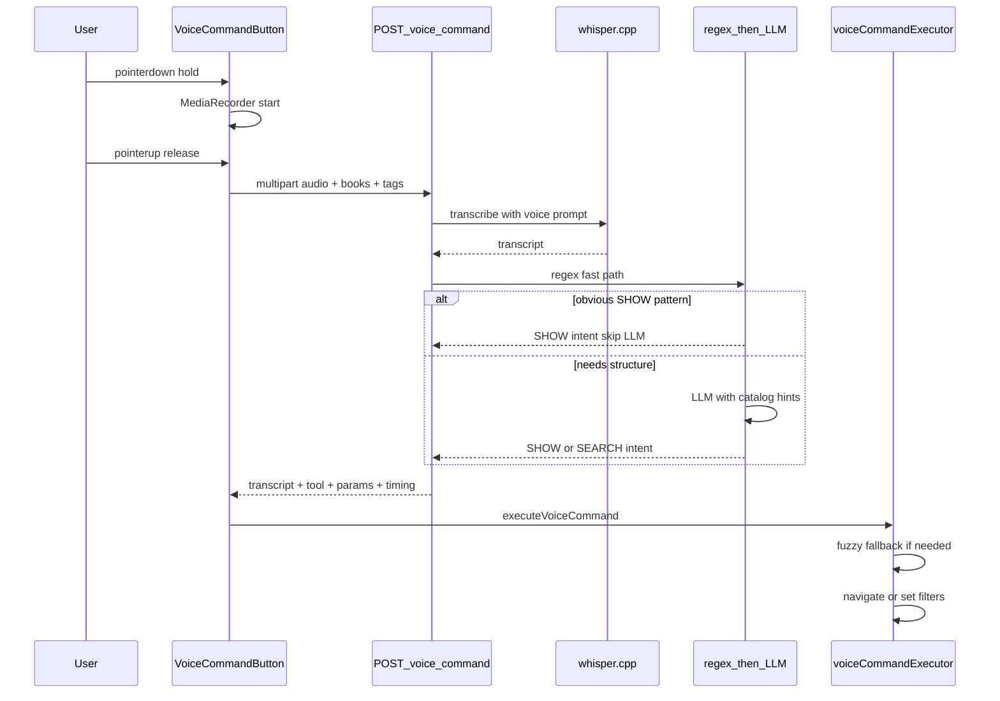

# Voice command microphone in header

## Goals and constraints

- **Mic button**: round, press-and-hold, fixed at **far right** of header on **all pages with header** (except `/print`) when `useMediaResolverHealth().available`.
- **v1 commands**: `SHOW <title>` (jump to tune), `SEARCH` (extract book/tag/artist/title filters).
- **Latency matters**: one combined server endpoint — no separate `/transcribe` + `/parse-voice-intent` round trips.
- **All optimizations included**: Whisper command prompt, regex fast path (skip LLM), catalog hints for SEARCH, client-side fuzzy SHOW fallback.
- **Playback commands** (PLAY/PAUSE/NEXT/PREV): deferred.

---

## How well this will work

| Aspect | Expectation |
|--------|-------------|
| End-to-end latency | ~2–8 s for a 2–5 s utterance on GPU resolver (Whisper dominates; LLM skipped on regex hits). Single HTTP request saves ~100–300 ms RTT vs two-step. |
| SHOW accuracy | Good when title is distinctive; fuzzy client match handles STT errors better than LLM picking IDs. |
| SEARCH accuracy | Good when book/tag names are in catalog hints; LLM maps spoken names to canonical list entries. |
| Mobile | Press-hold via Pointer Events works; header flex + compact buttons prevents overlap. |
| Failure modes | Empty transcript, mic denied, resolver offline, ambiguous titles — all need visible feedback. |

---

## Architecture (combined endpoint)



---

## Part 1 — Backend: `POST /voice-command`

### 1.1 New file: [`local-resolver/voice_command.py`](local-resolver/voice_command.py)

#### Constants / env

Reuse research LLM config with voice-specific overrides in [`.env.example`](local-resolver/.env.example):

```
VOICE_COMMAND_LLM_BASE_URL=          # falls back to RESEARCH_LLM_BASE_URL
VOICE_COMMAND_LLM_MODEL=             # falls back to RESEARCH_LLM_MODEL
VOICE_COMMAND_LLM_API_KEY=           # falls back to RESEARCH_LLM_API_KEY
VOICE_COMMAND_LLM_TIMEOUT_SECONDS=30
VOICE_COMMAND_LLM_MAX_TOKENS=300
VOICE_COMMAND_MAX_BOOKS=200
VOICE_COMMAND_MAX_TAGS=200
VOICE_COMMAND_WHISPER_PROMPT=Voice commands show search open go to find filter book tag artist.
VOICE_COMMAND_REGEX_CONFIDENCE=0.92
VOICE_COMMAND_LLM_CONFIDENCE_THRESHOLD=0.55
```

Voice-specific Whisper tuning (passed via `whisper_options` to existing `_transcribe_from_wav_path` in [`server.py`](local-resolver/server.py)):

```python
VOICE_WHISPER_OPTIONS = {
    "whisperPrompt": os.getenv("VOICE_COMMAND_WHISPER_PROMPT", "..."),
    "whisperLanguage": "en",
    "whisperBestOf": 1,      # short utterances — speed over breadth
    "whisperBeamSize": 1,
}
```

Also pass lyrics formatting off for commands by using raw transcript path: set env `WHISPER_LYRICS_FORMAT=false` for voice transcription only (override in whisper_options if supported, else call `_run_whisper_cli` and use raw joined segment text without `_format_transcribed_lyrics` stanza breaks — add `formatAsLyrics=False` flag to `_transcribe_from_wav_path`).

#### Request: multipart form

| Field | Type | Required | Description |
|-------|------|----------|-------------|
| `file` | file | yes | Audio blob from browser (`audio/webm` or `audio/wav`) |
| `books` | string (JSON array) | no | Canonical book names from client catalog |
| `tags` | string (JSON array) | no | Canonical tag names from client catalog |

Client caps lists at 200 entries each (sorted alphabetically) before upload.

#### Response JSON

```json
{
  "transcript": "show down by the sally gardens",
  "tool": "SHOW",
  "title": "Down By The Sally Gardens",
  "artist": "",
  "book": "",
  "tags": [],
  "searchText": "",
  "confidence": 0.92,
  "parseMethod": "regex",
  "timing": {
    "transcribeMs": 3200,
    "parseMs": 4,
    "totalMs": 3210
  }
}
```

| Field | Values |
|-------|--------|
| `tool` | `"SHOW"` \| `"SEARCH"` \| `"NONE"` |
| `parseMethod` | `"regex"` \| `"llm"` \| `"none"` (empty transcript) |
| `confidence` | 0.0–1.0 — client uses for fallback decisions |

#### Main entry: `async def process_voice_command(audio_bytes, filename, content_type, books, tags, request)`

Steps:

1. **Validate** — reject empty audio (`400`), cap audio size (reuse `MAX_STREAM_BYTES`).
2. **Transcribe** — write temp file → `_convert_audio_to_wav` → `_transcribe_from_wav_path(wav_path, request, require_text=False, whisper_options=VOICE_WHISPER_OPTIONS, format_as_lyrics=False)`.
3. **Normalize transcript** — `_normalize_space`, lowercase for parsing; keep original casing in response `transcript`.
4. **Regex fast path** — `parse_voice_intent_regex(normalized)` (see §1.2). If confidence ≥ `VOICE_COMMAND_REGEX_CONFIDENCE`, return immediately (**no LLM call**).
5. **LLM parse** — `parse_voice_intent_llm(transcript, books, tags)` (see §1.3).
6. **Return** combined body with timing breakdown.

#### Error responses

Use existing `json_error()` pattern. Examples:

- `400` — missing file, invalid JSON in books/tags fields
- `413` — audio too large
- `502` — Whisper failure
- `503` — LLM unreachable (only when regex didn't resolve)

On LLM failure after successful transcription: return `tool: "NONE"`, `parseMethod: "llm"`, `confidence: 0`, include `transcript` so client can run fuzzy SHOW fallback.

### 1.2 Regex fast path: `parse_voice_intent_regex(text)`

Operates on normalized lowercase transcript. Returns `(intent_dict, confidence)` or `(None, 0)`.

**SHOW patterns** (confidence 0.92, `parseMethod: regex`):

```python
SHOW_PREFIX_RE = re.compile(
    r"^(?:show|open|go to|play)\s+(.+)$", re.I
)
```

Also handle spoken punctuation variants: "go to the …" → strip leading "the " from captured group.

**Bare title heuristic** (confidence 0.75): if transcript has **no** SEARCH cue words and **no** SHOW prefix:

```python
SEARCH_CUE_WORDS = {"search", "find", "filter", "book", "tag", "tagged", "in", "by", "from", "with"}
# If none of these appear as whole words → treat as SHOW with title=full transcript
```

**SEARCH prefix detection** (confidence 0.80 for intent, but **always delegates param extraction to LLM**):

```python
SEARCH_PREFIX_RE = re.compile(r"^(?:search|find|filter)\s+(?:for\s+)?(.+)$", re.I)
```

When matched: call LLM with **narrow prompt** — only the captured remainder + catalogs — not full re-classification. Saves tokens and latency vs full intent prompt.

**Decision tree**:

```
transcript empty → NONE
match SHOW_PREFIX_RE → SHOW(title=group1)
</confidence>0.92)
match SEARCH_PREFIX_RE → LLM narrow parse on group1 only (parseMethod starts regex, finishes llm)
no cue words, len >= 2 → SHOW(title=transcript, confidence=0.75)
else → fall through to full LLM
```

### 1.3 LLM parse: `parse_voice_intent_llm(transcript, books, tags, narrow=False)`

HTTP POST to `{LLM_BASE_URL}/chat/completions` — same pattern as [`tune_background_research.py`](local-resolver/tune_background_research.py) lines 246–268.

**System prompt** (full mode):

```
You classify tunebook voice commands. Respond with JSON only, no markdown.
Schema: {"tool":"SHOW"|"SEARCH"|"NONE","title":"","artist":"","book":"","tags":[],"searchText":"","confidence":0.0-1.0}
Rules:
- SHOW: user wants to open/jump to a specific song. Bare song title without search/filter language is SHOW.
- SEARCH: user wants to filter the tune list. Extract book, tags (array), artist/composer, and general searchText.
- Map book and tag strings to the closest entry from the provided catalogs; use exact catalog spelling when matched.
- If book/tag not in catalog, leave empty rather than inventing.
- NONE: unintelligible or unrelated to music navigation.
```

**User prompt** (full mode):

```
TRANSCRIPT: "{transcript}"
BOOKS: {json.dumps(books[:200])}
TAGS: {json.dumps(tags[:200])}
```

**Narrow mode** (after SEARCH prefix regex): omit tool classification; ask only:

```
Extract search filters from: "{remainder}"
BOOKS: [...]
TAGS: [...]
Return JSON: {"book":"","tags":[],"artist":"","searchText":"","confidence":0.0-1.0}
```

Force `tool: "SEARCH"` on result.

**Response parsing**: reuse pattern from [`chords_fetch.py`](local-resolver/chords_fetch.py) `parse_llm_json_mapping` — extract JSON object from message content (fenced or bare). Validate required keys; coerce types.

**Catalog matching (server-side, post-LLM)**: `match_catalog_name(spoken, catalog_list)` — case-insensitive exact match first, then substring match (spoken in catalog name or vice versa). Replace LLM book/tag output with canonical catalog entry.

### 1.4 Route in [`local-resolver/server.py`](local-resolver/server.py)

```python
@app.post("/voice-command")
async def voice_command_endpoint(
    request: Request,
    file: UploadFile = File(...),
    books: str = Form(default="[]"),
    tags: str = Form(default="[]"),
    authorization: str | None = Header(default=None),
):
    await maybe_require_auth(authorization)
    track_resolver_usage("voice-command")
    # parse books/tags JSON, read file bytes, call process_voice_command(...)
```

Add `"voice-command"` to root `GET /` endpoints list.

**Whisper refactor** (small change in existing code):

Extend `_transcribe_from_wav_path(..., format_as_lyrics=True)` — when `False`, set `text = raw_text` (single line, no stanza formatting). Use this from `voice_command.py` instead of `forward_to_whisper` (which has no whisper_options param today).

### 1.5 Dev proxy: [`src/setupProxy.js`](src/setupProxy.js)

Add to `shouldProxyResolver`:

```javascript
|| pathname === '/voice-command'
```

---

## Part 2 — Frontend client layer

### 2.1 [`src/voiceCommandClient.js`](src/voiceCommandClient.js)

```javascript
export async function submitVoiceCommand({ blob, fileName, books, tags, accessToken, signal, onProgress })
```

Implementation:

1. Build `FormData`: append `file`, `books` (JSON.stringify), `tags` (JSON.stringify).
2. `fetchViaMediaProxy('/voice-command', accessToken, { method: 'POST', body: formData, signal, headers: { Accept: 'application/json' } })`.
3. Parse JSON; throw on `body.error` or non-OK.
4. `normalizeVoiceCommandResponse(body)` → typed result object.

Progress callbacks: `'Uploading…'` → `'Processing…'` (single wait state; no streaming in v1).

### 2.2 [`src/voiceCommandUtils.js`](src/voiceCommandUtils.js)

**Catalog serialization** (sent with every request):

```javascript
export function buildVoiceCatalogs(tunebook) {
  const books = Object.keys(tunebook.getTuneBookOptions() || {}).sort().slice(0, 200);
  const tags = Object.keys(tunebook.getTuneTagOptions() || {}).sort().slice(0, 200);
  return { books, tags };
}
```

**Stopword stripping** for client fallback:

```javascript
const VOICE_COMMAND_WORDS = new Set([
  'show', 'open', 'go', 'to', 'play', 'search', 'find', 'filter',
  'the', 'a', 'an', 'for', 'in', 'by', 'from', 'with', 'tag', 'tagged', 'book',
]);

export function stripVoiceCommandWords(text) { /* split, filter, rejoin */ }
```

**Fuzzy tune scoring**:

```javascript
export function scoreTuneMatch(query, tune) {
  // query and tune.name/composer normalized via toSearchText
  // score = 0
  // +10 exact name match
  // +6 name contains full query
  // +4 per query token found in name (length > 2)
  // +2 per query token found in composer
  // +3 if query tokens appear in order as substring of name
  // return score
}

export function findTuneCandidates(query, tunes, { limit = 10, minScore = 4 } = {}) {
  // Object.values(tunes).map score, filter minScore, sort desc, slice limit
}
```

Global search: **ignore current book/tag filters** for SHOW (user wants to jump anywhere).

### 2.3 [`src/voiceCommandExecutor.js`](src/voiceCommandExecutor.js)

```javascript
export function executeVoiceCommand(result, context)
```

**Context**:

```javascript:context
{
  tunes, tunebook,
  setFilter, setCurrentTuneBook, setTagFilter, setGroupBy,
  setCurrentTune,
  onDisambiguate: (candidates) => Promise<tune|null>,  // opens SearchResultPickerModal
  onFeedback: (message) => void,  // toast
  speakFeedback?: boolean,
}
```

**Execution logic**:

```
1. If !result.transcript → toast "Didn't catch that"; return

2. Determine effective tool:
   - if result.tool === 'SEARCH' && result.confidence >= 0.55 → SEARCH
   - else if result.tool === 'SHOW' && result.confidence >= 0.55 → SHOW with result.title
   - else → FALLBACK (client fuzzy SHOW on full transcript)

3. SHOW path:
   a. query = stripVoiceCommandWords(result.title || result.transcript)
   b. candidates = findTuneCandidates(query, tunes)
   c. 0 candidates → toast "No tune matching '{query}'"
   d. 1 candidate → setCurrentTune(id); tunebook.navigate('/tunes/' + id); speak optional
   e. 2+ candidates:
      - if top score >= 2x second score → auto-pick top
      - else → onDisambiguate(candidates mapped to { title, artist, id })

4. SEARCH path:
   a. clearAllFilters equivalent: setFilter(''), setCurrentTuneBook(''), setTagFilter([]), setGroupBy('')
   b. if result.book → setCurrentTuneBook(matchedBook)
   c. if result.tags?.length → setTagFilter(result.tags)
   d. searchText = result.searchText || result.title || ''
      artist = result.artist
      combine: if artist && searchText → setFilter(artist + ' ' + searchText) OR setFilter with best fit
      (prefer: setFilter([searchText, artist].filter(Boolean).join(' ')))
   e. tunebook.navigate('/tunes')
   f. toast "Searching for …"

5. FALLBACK path (NONE or low confidence, and not SEARCH):
   a. Same as SHOW with query = stripVoiceCommandWords(result.transcript)
   b. If transcript had SEARCH cue words and no match → toast "Try saying 'search …' or 'show …'"
```

**Disambiguation modal adapter** in `VoiceCommandButton`: map tune candidates to `SearchResultPickerModal` items `{ title: tune.name, artist: tune.composer, id: tune.id }`; on select → navigate.

---

## Part 3 — UI: `VoiceCommandButton`

### 3.1 New file: [`src/components/VoiceCommandButton.js`](src/components/VoiceCommandButton.js)

**Props**:

```javascript
{
  token, tunebook, tunes,
  setFilter, setCurrentTuneBook, setTagFilter, setGroupBy, setCurrentTune,
  setBlockKeyboardShortcuts,
}
```

**State machine**:

| State | UI |
|-------|-----|
| `idle` | Grey/green round mic icon |
| `recording` | Red background, CSS pulse animation, `aria-pressed="true"` |
| `processing` | Disabled mic, small inline spinner or Bootstrap spinner-border |
| `error` | Brief red border flash, revert to idle |

**Recording hook** — inline or extracted `useVoiceCapture.js`:

```javascript
const MIN_HOLD_MS = 300;
const MAX_RECORD_MS = 12000;
```

Pointer handlers on mic button:

```javascript
onPointerDown(e) {
  e.preventDefault();
  e.currentTarget.setPointerCapture(e.pointerId);
  holdTimer = setTimeout(() => startRecording(), MIN_HOLD_MS);
}
onPointerUp(e) {
  clearTimeout(holdTimer);
  if (recording) stopAndSubmit();
}
onPointerCancel → same as up
```

Recording implementation (from [`useAudioUtils.js`](src/useAudioUtils.js)):

- `navigator.mediaDevices.getUserMedia({ audio: true })`
- `MediaRecorder` with `ondataavailable` chunks
- On stop: `new Blob(chunks, { type: recorder.mimeType || 'audio/webm' })`
- Stop all `MediaStream` tracks after stop
- AbortController for in-flight `/voice-command` on new press

**On submit**:

1. `setBlockKeyboardShortcuts(true)` during recording + processing
2. `buildVoiceCatalogs(tunebook)`
3. `submitVoiceCommand({ blob, books, tags, accessToken: token?.access_token })`
4. `executeVoiceCommand(result, context)`
5. `setBlockKeyboardShortcuts(false)` in finally

**Feedback**:

- `react-toastify` for errors and success (existing app pattern)
- Optional `window.speak('Opening ' + tune.name)` when `localStorage.bookstorage_announcesong === 'true'`

**Accessibility**:

- `aria-label="Hold to speak a command"`
- `title="Hold to speak: show [song] or search [filters]"`

### 3.2 Styling

New CSS in [`src/App.css`](src/App.css):

```css
.header-voice-btn {
  flex-shrink: 0;
  width: 2.6em;
  height: 2.6em;
  border-radius: 50%;
  border: 2px solid #000;
  padding: 0;
  display: inline-flex;
  align-items: center;
  justify-content: center;
  touch-action: none;
  background: #888;
  color: #fff;
}
.header-voice-btn.recording {
  background: #dc3545;
  animation: voice-pulse 0.8s ease-in-out infinite;
}
.header-voice-btn.processing {
  opacity: 0.7;
  pointer-events: none;
}
@keyframes voice-pulse {
  0%, 100% { transform: scale(1); }
  50% { transform: scale(1.08); }
}
```

Reuse mic SVG from [`MicrophoneComponent.js`](src/components/MicrophoneComponent.js) (inline or import).

---

## Part 4 — Header layout refactor

### 4.1 [`src/components/Header.js`](src/components/Header.js)

**Structure change** — replace float layout:

```jsx
<header className="App-header">
  <span className="header-left">…nav + auth…</span>
  <span className="header-right">
    {(onTunesOrEditor) && (
      <span className="header-playback">
        <MediaPlayerButtons buttonSize={playbackButtonSize} … />
        {params.tuneId && (
          <ButtonGroup className="header-skip-buttons">…</ButtonGroup>
        )}
      </span>
    )}
    {resolverAvailable && (
      <VoiceCommandButton … />
    )}
  </span>
</header>
```

**New variables**:

```javascript
const playbackButtonSize = compactNav ? 'sm' : 'lg';
const resolverAvailable = useMediaResolverHealth().available;
```

**Props to add on Header** (from [`App.js`](src/App.js)): `tunes`, `setFilter`, `setTagFilter`, `setGroupBy`, `setCurrentTune`, `setCurrentTuneBook`, `setBlockKeyboardShortcuts` — most already passed or available on tunebook.

### 4.2 [`src/App.css`](src/App.css)

```css
.App-header {
  display: flex;
  align-items: center;
  justify-content: space-between;
  /* keep existing fixed positioning, height, colors */
}
.header-left {
  display: inline-flex;
  align-items: center;
  flex-shrink: 0;
  min-width: 0;
}
.header-right {
  display: flex;
  align-items: center;
  gap: 0.15em;
  margin-left: auto;
  flex-shrink: 1;
  min-width: 0;
}
.header-playback {
  display: inline-flex;
  align-items: center;
  gap: 0.1em;
  background-color: #5400ff;
  padding: 0.1em;
  flex-shrink: 1;
  min-width: 0;
}
```

Remove inline `float:'right'` from Header JSX.

### 4.3 Mobile behavior summary

| Viewport | Behavior |
|----------|----------|
| Desktop | Playback `lg`, mic 2.6 em, all controls visible |
| Mobile (`isMobile`) | Playback + skip `sm`, mic unchanged |
| ≤480 px | Auth moves to dropdown (existing); skip stays `sm` |
| Non-tunes routes | Only mic in `.header-right` — plenty of space |

---

## Part 5 — Command behavior reference

| Spoken | Server parse | Client action |
|--------|--------------|---------------|
| "show Sally Gardens" | regex → SHOW | Fuzzy match → navigate |
| "Down by the Sally Gardens" | regex bare title → SHOW | Fuzzy match |
| "search jigs in Steve's book tagged session" | regex+LLM → SEARCH | Clear filters, set book/tag/text, go to `/tunes` |
| "Martin Hayes" (ambiguous) | LLM → SHOW or NONE | Fuzzy match; picker if multiple |
| Mumbled / empty | NONE, no transcript | Toast error |

**SEARCH replaces filters** (not merge): predictable voice UX.

**SHOW ignores active book/tag filters** when matching.

---

## Part 6 — Tests

### 6.1 [`local-resolver/test_voice_command.py`](local-resolver/test_voice_command.py)

Unit tests (no live LLM/Whisper):

- `parse_voice_intent_regex`: SHOW prefixes, bare title, SEARCH prefix detection
- `match_catalog_name`: exact, case-insensitive, substring
- `normalize_voice_command_response`: schema validation
- `parse_llm_voice_json`: fenced JSON, malformed fallback
- Mock LLM HTTP with `httpx` mock or injected client

### 6.2 [`src/voiceCommandExecutor.test.js`](src/voiceCommandExecutor.test.js)

- `scoreTuneMatch` / `findTuneCandidates`: exact, partial, composer match
- `stripVoiceCommandWords`
- `executeVoiceCommand`: SHOW single/multiple/none; SEARCH applies filters; fallback from NONE
- Top candidate auto-pick when score gap ≥ 2x

---

## Part 7 — File checklist

| File | Action |
|------|--------|
| `local-resolver/voice_command.py` | **Create** — core parse + orchestration |
| `local-resolver/test_voice_command.py` | **Create** |
| `local-resolver/server.py` | **Edit** — route, `_transcribe_from_wav_path` format flag |
| `local-resolver/.env.example` | **Edit** — voice command env vars |
| `local-resolver/README.md` | **Edit** — document endpoint |
| `src/setupProxy.js` | **Edit** — proxy path |
| `src/voiceCommandClient.js` | **Create** |
| `src/voiceCommandUtils.js` | **Create** |
| `src/voiceCommandExecutor.js` | **Create** |
| `src/voiceCommandExecutor.test.js` | **Create** |
| `src/components/VoiceCommandButton.js` | **Create** |
| `src/components/Header.js` | **Edit** — flex layout, mount mic |
| `src/App.css` | **Edit** — header flex + voice btn styles |
| `src/App.js` | **Edit** — pass props to Header if any missing |

**Not used in v1**: separate `/parse-voice-intent`, `MicrophoneComponent.js` (reference only), `transcribeLyricsSource` for voice path.

---

## Implementation order

1. **Backend first** — `voice_command.py` + route + tests (regex/parse logic testable without UI).
2. **Client utils + executor + tests** — can test against mock API responses.
3. **voiceCommandClient.js** — thin fetch wrapper.
4. **Header layout refactor** — flex CSS + compact buttons (can land before mic).
5. **VoiceCommandButton** — wire end-to-end.
6. **Manual test plan**: resolver up, hold mic "show [known tune]", hold "search [book name]", ambiguous title, no resolver (button hidden), mobile viewport.
